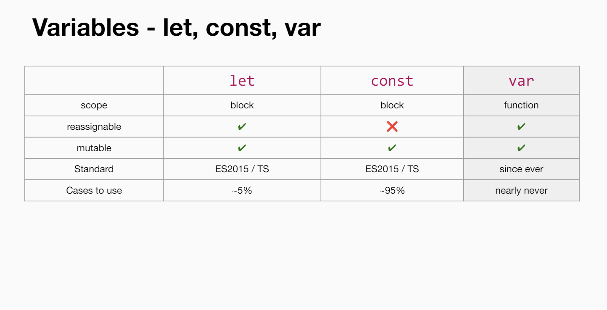
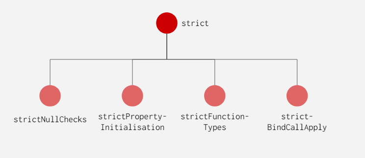

# Typescript & React Intensivsschulung 14.08.-21.08.24 via Zoom

Trainer: Alexander Zeiss

[Classroom; Access-Token: bIGeyh8](https://workshops.de/classroom/4310852928/dashboard)
[Workshop Github](https://github.com/derzeiss/workshopsde-2408)

## Use

 - Reference Types: `string[]`, `Array<string>`, `ReadonlyArray<string>`
 - `unknown` erfordert entweder Type assertion `zb.: as  ` oder Laufzeitprüfung:
   `if (typeof SomeObj === 'string') { /* Hier hat SomeObj den Typ String anstatt unknown */ }` 
- `ref` anwenden!
- Unterscheide interface und types herausarbeiten
- React als Single source of truth
 
1. `useLoaderData()`
2. `myKey in keyof SomeArray` vs `Object.values()` und `Object.values(errors).some((err) => { setHasError(true)} )`
3. Form bucket
4. `some.val as Record<String, null>`
5. Partial usw...
6. Storybook
7.  @testing-library
    1. Testing: getBy... Queries
    2. Snapshot test
8.  Synthetisches Event


## Feedback

1. Bei Fragen dlänger zum antworten zeit lassen
2. Classroom usw erklären
3. Aufgabenbeschreibung zu schnell, auch wenn sich keiner meldet soll man warten und doppelt angeben (zb.: erste React app)
   1. Die Beispiele langsamer erklären & durchgehen
   2. Zeit für Beispiele
4. Gruppenaustausch - vl. auch mal ein Übung gemeinsam
5. Nachschlagwerke, Docs, Infomaterial anbieten mit dem auch noch nach der Schulung gearbeitet werden kann
6. Deutsche Materialien
7. Wenn du verweist auf die folien "da stand das drinnen" - ch kann als tn nicht dir folgen, die sdlides offen habenm, notizen machen, usw...
8. keine Zeit für notizen
9. Folien mit Grafiken teilweise nur 3 sekunden dann weiter
10. In den Folien hin und her springen ist schwierig
11. Fachbegriffe wie gerendert oder Dependency tree nochmals für alle erklären

## Offene Fragen

1. **Was passiert, wenn man einen Error wirft, aber kein `catch()` implementiert?**
   Der Error wird dazu führen, dass das Programm abgebrochen wird.
2. Extends & Intersection Type: `type Magazine = Book & {  coverUrl: string; }`
3. 

## Schnell-Tipps

1. Interfaces dürfen nur einmal im Projekt vorkommen, ansonsten werden sie gemerged. Daher vl Interfaces eine eigene datei
2. Funktionstypen for unions of type literals und primitive typen usw.. mit Type Aliases annstatt mit Interfaces
3. 

## Objects: Computed Property Names - Namen von Objekteigenschaften dynamisch zur Laufzeit zu bestimmen

"Computed Property Names" sind ein Feature in JavaScript (und somit auch in TypeScript), das es ermöglicht, die Namen von Objekteigenschaften dynamisch zur Laufzeit zu bestimmen. Dies ist besonders nützlich, wenn man den Namen einer Eigenschaft basierend auf einer Variable oder einem Ausdruck generieren möchte.

### Grundlagen

Normalerweise definiert man eine Eigenschaft eines Objekts so:

```typescript
const obj = {
  key: 'value'
};
```

Hier ist `key` der statische Name der Eigenschaft.

Mit "Computed Property Names" kann man den Namen einer Eigenschaft jedoch dynamisch festlegen, indem man den Namen der Eigenschaft in eckige Klammern `[]` setzt und darin einen Ausdruck oder eine Variable angibt. Der Ausdruck wird ausgewertet, und das Ergebnis wird als Name der Eigenschaft verwendet.

### Beispiel

Angenommen, man hat eine Variable, deren Wert als Name einer Eigenschaft verwendet werden soll:

```typescript
const propName = 'name';

const obj = {
  [propName]: 'John Doe'
};

console.log(obj.name); // Ausgabe: John Doe
```

In diesem Beispiel wird die Variable `propName` in den eckigen Klammern verwendet. Da `propName` den Wert `'name'` enthält, wird das Objekt `obj` eine Eigenschaft mit dem Namen `name` haben.

### Komplexere Beispiele

Man kann auch komplexere Ausdrücke verwenden, um Eigenschaftsnamen zu berechnen:

```typescript
const prefix = 'user';
const id = 42;

const user = {
  [`${prefix}_${id}`]: 'Jane Doe'
};

console.log(user['user_42']); // Ausgabe: Jane Doe
```

Hier wird der Ausdruck `` `${prefix}_${id}` `` verwendet, um den Eigenschaftsnamen `user_42` dynamisch zu erstellen.

### Verwendung in TypeScript

TypeScript unterstützt "Computed Property Names" genauso wie JavaScript, allerdings bietet TypeScript zusätzlich Typensicherheit. Wenn man "Computed Property Names" in TypeScript verwendet, sollte man sicherstellen, dass die resultierenden Eigenschaftsnamen im Typ des Objekts vorgesehen sind, um Typfehler zu vermeiden.

```typescript
type User = {
  [key: string]: string;
};

const dynamicKey = 'email';

const user: User = {
  [dynamicKey]: 'jane.doe@example.com'
};
```

Hier wird der Typ `User` so definiert, dass er eine beliebige Anzahl von string-Eigenschaften haben kann. Der Schlüssel `dynamicKey` wird dann verwendet, um die Eigenschaft `email` dynamisch hinzuzufügen.

### Fazit

"Computed Property Names" sind ein mächtiges Werkzeug, um dynamisch und flexibel mit Objekten in JavaScript und TypeScript zu arbeiten. Sie ermöglichen es, Eigenschaftsnamen zur Laufzeit zu berechnen, was besonders nützlich ist, wenn man mit dynamischen Datenstrukturen arbeitet oder wenn man Eigenschaftsnamen basierend auf Variablen oder Ausdrücken generieren muss.

## Variables: let, const, var



## Shallow Copy

### Was ist eine Shallow Copy?

Eine shallow copy eines Objekts kopiert nur die oberste Ebene des Objekts, d. h., die Eigenschaften auf der ersten Ebene des Objekts werden direkt kopiert. Wenn eine dieser Eigenschaften jedoch selbst ein Objekt (oder ein Array) ist, wird **nicht** das gesamte Unterobjekt kopiert, sondern nur die **Referenz** auf dieses Unterobjekt. Dadurch zeigt die Kopie auf dieselben Unterobjekte wie das Original.

### Beispiel mit einem tief verschachtelten Objekt:

Nehmen wir an, du hast folgendes Objekt:

```javascript
let original = {
  level1: {
    level2: {
      value: 42
    }
  }
};
```

Wenn du eine shallow copy dieses Objekts erstellst:

```javascript
let shallowCopy = { ...original };
```

Was passiert hier?

1. **Erste Ebene**: Das Objekt `shallowCopy` hat eine eigene Kopie der Eigenschaften auf der obersten Ebene des Objekts `original`. In diesem Fall wird die Eigenschaft `level1` kopiert.

2. **Zweite und dritte Ebene**: Da `level1` ein Objekt ist, wird **nur die Referenz** auf das Objekt `level1` kopiert. Das bedeutet, dass sowohl `original.level1` als auch `shallowCopy.level1` auf dasselbe Objekt im Speicher zeigen. Daher zeigt `shallowCopy.level1.level2` auch auf dasselbe Objekt wie `original.level1.level2`.

### Auswirkungen

Wenn du also eine Änderung am Objekt auf einer tieferen Ebene vornimmst, wirkt sich dies sowohl auf das Originalobjekt als auch auf die flache Kopie aus, da beide auf dasselbe tieferliegende Objekt verweisen.

Beispiel:

```javascript
shallowCopy.level1.level2.value = 100;

console.log(original.level1.level2.value); // Ausgabe: 100
```

Die Änderung am `value` in der flachen Kopie hat das Originalobjekt beeinflusst, da beide auf dasselbe `level2`-Objekt verweisen.

### Shallow Copy Zusammengefasst:

- **Kopiert nur die oberste Ebene** eines Objekts.
- **Referenzen** auf verschachtelte Objekte oder Arrays werden kopiert, nicht die tatsächlichen Werte.
- Änderungen an verschachtelten Objekten beeinflussen sowohl das Originalobjekt als auch die flache Kopie.

Falls du eine **deep copy** (tiefe Kopie) erstellen möchtest, bei der alle Ebenen des Objekts rekursiv kopiert werden, musst du eine spezielle Technik verwenden, z. B. durch Rekursion oder den Einsatz von Bibliotheken wie `lodash` (mit `_.cloneDeep()`).

### Fazit

Ja, bei einer shallow copy werden nur die Referenzen auf die Objekte der ersten Ebene kopiert, nicht die tieferliegenden Objekte selbst. Das bedeutet, dass die Kopie und das Originalobjekt weiterhin auf dieselben tieferliegenden Objekte verweisen, was bei Änderungen an diesen tieferliegenden Objekten zu unerwartetem Verhalten führen kann, wenn man nicht vorsichtig ist.

## Arrow Function

### Objekt zurückgeben

Verwende runde und geschweifte Klammern, wenn ein Objekt zurückgegeben werden soll:

```javascript
const person = () => ({
 firstName: 'John',
 lastName: 'Doe',
});
```


## Compiler flag: strict



### 1. `strictNullChecks`

- **Bedeutung:** Diese Regel bewirkt, dass `null` und `undefined` **nicht** automatisch als gültige Werte für alle Typen akzeptiert werden. In anderen Worten, `null` und `undefined` sind nur gültig, wenn sie explizit im Typ enthalten sind.
- **Beispiel:**
  ```typescript
  let str: string = "hello";
  str = null; // Fehler, wenn `strictNullChecks` aktiviert ist.
  
  let strOrNull: string | null = "hello";
  strOrNull = null; // Korrekt, da der Typ `string | null` zulässt.
  ```

### 2. `strictPropertyInitialization`

- **Bedeutung:** Diese Regel stellt sicher, dass alle Eigenschaften einer Klasse ordnungsgemäß initialisiert werden, bevor sie verwendet werden. Das bedeutet, dass jede nicht-`undefined`-Eigenschaft im Konstruktor initialisiert oder mit einem Standardwert versehen werden muss, es sei denn, die Eigenschaft wird als optional (`?`) markiert.
- **Beispiel:**
  ```typescript
  class Person {
      name: string;
      age: number; // Fehler: `age` wird nicht im Konstruktor initialisiert.

      constructor(name: string) {
          this.name = name;
      }
  }
  
  class PersonCorrect {
      name: string;
      age: number;

      constructor(name: string, age: number) {
          this.name = name;
          this.age = age; // Korrekt, `age` wird initialisiert.
      }
  }
  ```

### 3. `strictFunctionTypes`

- **Bedeutung:** Diese Regel verschärft die Überprüfung der Kompatibilität von Funktionssignaturen. Konkret bedeutet dies, dass TypeScript sicherstellt, dass Funktionen, die als Typen verwendet werden, kompatibel sind, indem es die Parameter- und Rückgabewerte strikter überprüft.
- **Beispiel:**
  ```typescript
  type Func = (a: number) => void;
  let func1: Func = (a: number) => {}; // Korrekt.
  let func2: Func = (a: string) => {}; // Fehler, da `a` ein `number` sein sollte.
  ```

### 4. `strictBindCallApply`

- **Bedeutung:** Diese Regel stellt sicher, dass die Methoden `bind`, `call` und `apply` korrekt verwendet werden. Wenn man `bind`, `call` oder `apply` auf eine Funktion anwendet, stellt TypeScript sicher, dass die übergebenen Argumente den Typen der ursprünglichen Funktionssignatur entsprechen.
- **Beispiel:**
  ```typescript
  function add(a: number, b: number): number {
      return a + b;
  }

  let addBound = add.bind(null, 10);
  addBound("20"); // Fehler: `20` ist kein `number`.
  
  addBound(20); // Korrekt.
  ```

## Nullish Coalescing Operator (`??`)

Der **Nullish Coalescing Operator (`??`)** ist ein spezieller Operator in JavaScript, der in der Version ECMAScript 2020 (ES11) eingeführt wurde. Dieser Operator wird verwendet, um einen Ausdruck auf `null` oder `undefined` zu prüfen und einen Fallback-Wert zurückzugeben, wenn der Ausdruck `null` oder `undefined` ist.

### Syntax und Funktionsweise

```javascript
let result = expression1 ?? expression2;
```

- **`expression1`**: Der erste Ausdruck, der ausgewertet wird.
- **`expression2`**: Der zweite Ausdruck, der zurückgegeben wird, wenn `expression1` `null` oder `undefined` ist.

Der Operator `??` funktioniert so, dass er `expression1` zurückgibt, wenn dieser Wert weder `null` noch `undefined` ist. Ist `expression1` jedoch `null` oder `undefined`, wird `expression2` zurückgegeben.

### Beispiel:

```javascript
let name = null;
let defaultName = "John Doe";

let displayName = name ?? defaultName;
console.log(displayName); // Ausgabe: "John Doe"
```

In diesem Beispiel ist `name` auf `null` gesetzt. Der Nullish Coalescing Operator prüft, ob `name` `null` oder `undefined` ist. Da `name` `null` ist, wird `defaultName` als Fallback-Wert verwendet, und "John Doe" wird in `displayName` gespeichert.

### Unterschiede zu anderen Operatoren

Der Nullish Coalescing Operator ähnelt dem **logischen OR-Operator (`||`)**, aber es gibt wichtige Unterschiede:

- **`||`-Operator:**
  Der logische OR-Operator gibt den ersten "truthy" Wert zurück. Das bedeutet, dass er auch bei Werten wie `0`, `false`, `NaN`, `''` (leere Zeichenfolge) den zweiten Ausdruck zurückgibt, da diese als "falsy" gelten.

- **`??`-Operator:**
  Der Nullish Coalescing Operator gibt den ersten Wert zurück, es sei denn, er ist `null` oder `undefined`. Er ignoriert andere "falsy" Werte wie `0`, `false`, `NaN`, `''`.

### Vergleich von `??` und `||`

**Beispiel mit `||`:**

```javascript
let count = 0;
let defaultCount = 5;

let finalCount = count || defaultCount;
console.log(finalCount); // Ausgabe: 5
```

In diesem Fall gibt der `||`-Operator `defaultCount` zurück, weil `0` als "falsy" betrachtet wird, obwohl `count` nicht `null` oder `undefined` ist.

**Beispiel mit `??`:**

```javascript
let count = 0;
let defaultCount = 5;

let finalCount = count ?? defaultCount;
console.log(finalCount); // Ausgabe: 0
```

Hier gibt der Nullish Coalescing Operator `count` zurück, weil `0` zwar "falsy", aber nicht `null` oder `undefined` ist.

### Anwendung

Der Nullish Coalescing Operator ist besonders nützlich, wenn Sie nur `null` oder `undefined` abfangen möchten, aber `0`, `false`, oder leere Zeichenfolgen als gültige Werte beibehalten möchten.

### Beispielanwendung:

```javascript
function getUserName(user) {
    return user.name ?? "Anonymous";
}

let user1 = { name: "Alice" };
let user2 = { name: "" };
let user3 = { name: null };

console.log(getUserName(user1)); // Ausgabe: "Alice"
console.log(getUserName(user2)); // Ausgabe: "" (leere Zeichenfolge bleibt bestehen)
console.log(getUserName(user3)); // Ausgabe: "Anonymous"
```

In diesem Beispiel wird `user.name` verwendet, wenn es nicht `null` oder `undefined` ist. Falls `user.name` jedoch `null` oder `undefined` ist, wird "Anonymous" zurückgegeben.

### Fazit

Der Nullish Coalescing Operator `??` ist ein nützliches Werkzeug, um auf `null` und `undefined` zu prüfen und standardmäßige Fallback-Werte anzugeben, ohne andere "falsy" Werte wie `0` oder `false` zu beeinflussen. Dies macht ihn zu einem wertvollen Operator in Situationen, in denen solche Unterscheidungen wichtig sind.

## `.bind`

In TypeScript (und JavaScript) ist die Methode `bind` dazu da, eine Funktion an einen bestimmten Kontext (`this`) zu binden und eventuell auch einige der Parameter vorab festzulegen. Hier ist eine Erklärung, wie das mit `null` funktioniert:

### Erklärung des Codes

```typescript
function add(a: number, b: number): number {
    return a + b;
}

let addBound = add.bind(null, 10);
addBound(20); // Funktioniert korrekt
```

#### Was passiert hier?

1. **`bind` und `this`-Kontext**: 
   - Die erste Argumente von `bind` legt den Wert von `this` für die gebundene Funktion fest. Wenn `null` als erster Parameter übergeben wird, bedeutet das, dass kein spezieller `this`-Kontext festgelegt wird. Der `this`-Kontext wird in diesem Fall als `null` behandelt, was in den meisten Fällen bedeutet, dass `this` entweder auf den globalen Kontext (z.B. `window` in einem Browser) oder `undefined` gesetzt wird, wenn `strict mode` aktiv ist.

2. **`bind` und feste Parameter**: 
   - Die nachfolgenden Argumente (`10` in diesem Fall) werden als feste Argumente für die gebundene Funktion festgelegt. In diesem Beispiel wird `a` auf `10` gesetzt.
   - Die gebundene Funktion (`addBound`) erwartet daher nur noch den zweiten Parameter (`b`), da `a` bereits auf `10` festgelegt wurde.

### Wird `null` ersetzt?

- **`this`-Kontext:** In diesem Beispiel spielt der `this`-Kontext keine Rolle, weil die `add`-Funktion den `this`-Kontext nicht verwendet. Daher wird das `null`, das an `bind` übergeben wird, nicht in der Funktion selbst verwendet oder ersetzt.
  
- **Gebundene Parameter:** Wenn man die gebundene Funktion `addBound` aufruft, gibt man nur die verbleibenden Argumente an. Im Beispiel `addBound(20);` wird `20` als das zweite Argument (`b`) verwendet, da das erste Argument (`a`) bereits auf `10` festgelegt ist.

```typescript
// Der ursprüngliche Aufruf von `add`
add(10, 20); // ergibt 30

// Der Aufruf von `addBound` nach dem Binden
addBound(20); // ergibt ebenfalls 30
```

### Was passiert bei `addBound("20")`?

In Ihrem Beispiel:

```typescript
addBound("20"); // Fehler in TypeScript
```

- **TypeScript**: Da `addBound` erwartet, dass der Parameter `b` eine Zahl (`number`) ist, führt die Übergabe einer Zeichenkette (`"20"`) zu einem Typfehler in TypeScript. Dies ist ein Feature von TypeScript, das Typensicherheit bietet.
  
- **JavaScript**: In reinem JavaScript würde `"20"` in eine Zahl konvertiert, und die Funktion würde trotzdem funktionieren und `30` zurückgeben, weil JavaScript die Typen automatisch konvertiert.

### Zusammenfassung

Das `null`, das bei `bind` übergeben wird, bezieht sich auf den `this`-Kontext und wird nicht durch einen Wert ersetzt. Die gebundenen Parameter (z.B. `10`) bleiben fest, und alle weiteren Argumente, die beim Aufruf der gebundenen Funktion übergeben werden, vervollständigen die Argumentliste. In TypeScript muss man darauf achten, dass die Typen der übergebenen Argumente den erwarteten Typen entsprechen, sonst gibt es einen Fehler.

## Non-Null Assertion Operator

A new ! post-fix expression operator may be used to assert that its operand is non-null and non-undefined in contexts where the type checker is unable to conclude that fact. For example:

```typescript
// Compiled with --strictNullChecks
function validateEntity(e?: Entity) {
    // Throw exception if e is null or invalid entity
}

function processEntity(e?: Entity) {
    validateEntity(e);
    let a = e.name;  // TS ERROR: e may be null.
    let b = e!.name;  // OKAY. We are asserting that e is non-null.
}
```

Note that it is just an assertion, and just like type assertions you are responsible for making sure the value is not null. A non-null assertion is essentially you telling the compiler "I know it's not null so let me use it as though it's not null".

## `Symbol`

Ein `Symbol` ist ein einzigartiger und unveränderlicher Wert, der als Schlüssel für Objekte verwendet werden kann. Symbole werden in JavaScript oft verwendet, um Objektschlüssel zu erstellen, die garantiert einzigartig sind. Selbst wenn zwei Symbole denselben Beschreibungsstring haben, sind sie nicht gleich – jedes Symbol ist ein einzigartiges Objekt.

  - **`Symbol`** ist ein primitiver Datentyp, der für einzigartige und unveränderliche Werte steht.
  - Symbole sind nützlich, um **eindeutige Objektschlüssel** zu erstellen, die keine Kollisionen verursachen.
  - Symbole können als **"private" Schlüssel** verwendet werden, da sie in normalen Aufzählungen nicht erscheinen.
  - **Erstellung:** Mit `Symbol('Beschreibung')` kannst du ein Symbol erstellen.
  - **Verwendung als Schlüssel:** Symbole können als Schlüssel in Objekten verwendet werden, indem du sie in eckige Klammern setzt, z.B. `[symbol]: 'Wert'`.

### Eigenschaften von `Symbol`:

- **Einzigartigkeit**: Jedes Symbol ist einzigartig. Selbst wenn zwei Symbole mit demselben Beschreibungsstring erstellt werden, sind sie unterschiedliche Werte.
  
- **Unveränderlichkeit**: Ein Symbol-Wert kann nicht geändert werden, nachdem er erstellt wurde.

- **Nicht aufgelistet**: Symbole werden von JavaScript nicht in normalen Schleifen (`for...in`, `Object.keys`, etc.) aufgelistet. Sie sind jedoch durch spezielle Methoden wie `Object.getOwnPropertySymbols` zugänglich.

### Wie erstellt man ein `Symbol`?

Symbole werden mit der globalen Funktion `Symbol()` erstellt. Du kannst optional einen Beschreibungsstring übergeben, der nützlich für Debugging oder Protokollierungszwecke ist, aber dieser hat keinen Einfluss auf die Identität des Symbols.

```javascript
const mySymbol = Symbol('mySymbol');
console.log(mySymbol); // Symbol(mySymbol)
```

### Verwendung von Symbolen als Objektschlüssel

Ein häufiger Anwendungsfall für Symbole ist die Verwendung als Schlüssel in Objekten. Da Symbole einzigartig sind, kannst du sicher sein, dass die mit ihnen verbundenen Werte nicht versehentlich überschrieben werden, auch wenn andere Teile deines Codes dieselben Schlüsselstrings verwenden.

```javascript
const symbolKey1 = Symbol('key');
const symbolKey2 = Symbol('key');

const myObject = {
  [symbolKey1]: 'Wert 1',
  [symbolKey2]: 'Wert 2'
};

console.log(myObject[symbolKey1]); // Ausgabe: 'Wert 1'
console.log(myObject[symbolKey2]); // Ausgabe: 'Wert 2'

// Beachte, dass symbolKey1 und symbolKey2 unterschiedlich sind, obwohl sie denselben Beschreibungsstring haben.
console.log(symbolKey1 === symbolKey2); // Ausgabe: false
```

### Vorteile der Verwendung von Symbolen als Schlüssel:

1. **Kollisionen vermeiden**: Da Symbole immer einzigartig sind, wird das Risiko minimiert, dass ein Schlüssel in einem Objekt versehentlich überschrieben wird.

2. **Private Eigenschaften simulieren**: Obwohl JavaScript keine echten privaten Eigenschaften unterstützt, können Symbole als "quasi-private" Schlüssel verwendet werden, da sie in normalen Aufzählungen nicht sichtbar sind.

#### Zugriff auf Symbol-Schlüssel

Wie erwähnt, werden Symbole nicht durch normale Methoden wie `Object.keys()` oder `for...in` aufgelistet. Um auf die Symbol-Schlüssel eines Objekts zuzugreifen, kannst du `Object.getOwnPropertySymbols()` verwenden.

#### Beispiel:

```javascript
const sym1 = Symbol('key1');
const sym2 = Symbol('key2');

const myObject = {
  [sym1]: 'Value 1',
  [sym2]: 'Value 2'
};

const symbols = Object.getOwnPropertySymbols(myObject);
console.log(symbols); // Ausgabe: [Symbol(key1), Symbol(key2)]
```

### Benötigt man `Symbol` als `key` in React?

**Kurz gesagt:** **Nein, man benötigt in der Regel kein `Symbol` als `key` in React-Komponenten.** 

In React ist es üblich, eine eindeutige `key`-Prop zu verwenden, wenn man mit `map` eine Liste von Elementen rendert. Diese `key`-Prop hilft React, effizient zu erkennen, welche Elemente in der Liste hinzugefügt, entfernt oder neu angeordnet wurden. Ein häufiger Ansatz ist es, eindeutige IDs (wie eine Datenbank-ID) oder Indexwerte als `key` zu verwenden.

   - **Verwende `Symbol` nicht als `key` in React.**
   - Verwende stattdessen stabile und eindeutige Werte wie IDs oder andere unveränderliche Werte, die die Identität eines Elements über mehrere Renderzyklen hinweg konsistent halten.
   - Der `key`-Wert sollte stabil und reproduzierbar sein, um die Effizienz von React zu maximieren.

#### Warum nicht `Symbol`?

1. **Eindeutigkeit ist nicht das Problem**: Der Hauptzweck eines `Symbol` ist es, einzigartige Schlüssel zu erzeugen, die niemals kollidieren. In React jedoch ist die `key`-Prop dazu da, React zu helfen, Elemente in einer Liste zu identifizieren. Hier geht es eher darum, stabile und reproduzierbare Werte zu haben, nicht unbedingt um absolute Einzigartigkeit wie bei `Symbol`.

2. **Verwendbarkeit und Wiedererkennung**: React verwendet die `key`-Prop, um Elemente zwischen verschiedenen Renderzyklen wiederzuerkennen. Symbole sind einzigartig, aber wenn du bei jedem Rendern ein neues `Symbol` als `key` generierst, erkennt React das Element nicht wieder, da jedes Symbol anders ist.

3. **Typische Verwendung von `key`:** 
   - Am besten verwendet man eine stabile und eindeutige ID als `key`, wie eine Datenbank-ID oder eine andere eindeutige Kennung, die sich nicht ändert.
   - Alternativ wird manchmal der Index verwendet, insbesondere wenn die Reihenfolge der Liste unveränderlich ist. Der Index ist jedoch nicht ideal, wenn die Reihenfolge der Liste sich ändern kann.

#### Beispiel mit einer ID als `key`:

```javascript
const items = [
  { id: 1, name: 'Item 1' },
  { id: 2, name: 'Item 2' },
  { id: 3, name: 'Item 3' },
];

function ItemList() {
  return (
    <ul>
      {items.map(item => (
        <li key={item.id}>{item.name}</li>
      ))}
    </ul>
  );
}
```

#### Was passiert, wenn du ein Symbol als `key` verwendest?

Wenn du ein `Symbol` als `key` verwendest, wäre es zwar technisch möglich, aber es würde nicht die Vorteile bringen, die man von einem stabilen und wiedererkennbaren Schlüssel erwartet. Da Symbole jedes Mal einzigartig sind, würde React denken, dass sich jedes Element bei jedem Rendern geändert hat, was zu unnötigen Neurenderings und potenziellen Leistungsproblemen führen könnte.

## `Object` als Typ vermeiden: `Record<>` oder `[index]`

### Typen für Objekte in TypeScript

**Warum `Object` vermeiden?**
Der Typ `Object` sollte in TypeScript in der Regel vermieden werden, wenn du ein Objekt als Typ definieren möchtest. Das liegt daran, dass `Object` sehr generisch ist und fast alles in TypeScript (außer `null` und `undefined`) von `Object` abgeleitet ist. Daher bietet `Object` nicht die strikte Typüberprüfung, die du möglicherweise benötigst. Die Verwendung von `Object` ist fast so, als würdest du `any` verwenden, was den Nutzen von TypeScript einschränkt.

  - **Vermeide `Object`**: Der Typ `Object` ist zu generisch und bietet keine sinnvolle Typüberprüfung.
  - **Verwende `Record<K, T>`**: Wenn du ein Objekt mit festgelegten Schlüsseln und Werten typisieren möchtest, ist `Record<K, T>` eine hervorragende Wahl.
  - **Verwende Index-Signaturen**: Wenn die Schlüssel eines Objekts dynamisch und nicht im Voraus bekannt sind, bietet sich eine Index-Signatur wie `{ [key: string]: unknown }` an.

```typescript
// Beispiel mit `Record<>` als `type`:

type MyRec = Record<string, number>

const fn = (par: MyRec) => {
    return true
}

fn({age: 78})


// Beispiel mit index
const user: { [key: string]: string } = {
  some: 11,
  age: 30
};

fn(user)
```

#### `Record<K, T>`

Statt `Object` zu verwenden, bietet sich der Typ `Record<K, T>` an, wenn du ein Objekt mit spezifischen Schlüsseltypen und Werttypen definieren möchtest.

  - **`Record<K, T>`** ist eine generische Utility-Typdefinition in TypeScript:
    - `K` steht für den Typ der Schlüssel (`key`).
    - `T` steht für den Typ der Werte (`value`).
  
```typescript
const userRoles: Record<string, string> = {
  admin: 'Admin',
  user: 'User',
  guest: 'Guest',
};
```

In diesem Beispiel ist `userRoles` ein Objekt, bei dem sowohl die Schlüssel als auch die Werte vom Typ `string` sind. `Record<string, string>` bedeutet, dass die Schlüssel beliebige Strings sein können und die dazugehörigen Werte ebenfalls Strings sein müssen.

#### Index-Signaturen: `[key: string]: unknown`

Wenn du ein Objekt mit dynamischen Schlüsseln typisieren möchtest, deren Namen du nicht im Voraus kennst, kannst du eine Index-Signatur verwenden:

- **Index-Signatur**: `[key: string]: unknown` bedeutet, dass das Objekt beliebige Schlüssel vom Typ `string` haben kann und dass die Werte dieser Schlüssel vom Typ `unknown` sind.

Beispiel:

```typescript
const config: { [key: string]: unknown } = {
  apiUrl: "https://api.example.com",
  retryAttempts: 5,
  useSsl: true,
};
```

Hier kann `config` beliebige Schlüssel vom Typ `string` haben, und die Werte dieser Schlüssel können jeden Typ annehmen, aber sie sind zunächst als `unknown` getypt, was bedeutet, dass du sie explizit in den erwarteten Typ umwandeln musst, bevor du sie verwenden kannst.

`{ [key: string]: unknown }` bedeutet also, Wie auch immer `key` tatsächlich im Objekt genannt wird, es ist ein `string` mit einem Wert vom Typ `unkown`

### Gültige Schlüsseltypen für `Objects`

In TypeScript können die Schlüssel (Keys) eines Objekts in der Regel nur bestimmte Typen haben. Die Standardregel ist, dass die Schlüssel von Objekten entweder `string`, `number` oder `symbol` sein können. 

- **`string`** ist der häufigste und standardmäßig verwendete Typ für Objektschlüssel.
- **`number`**-Schlüssel werden automatisch in `string` umgewandelt.
- **`symbol`**-Schlüssel sind einzigartig und ermöglichen die Erstellung von eindeutig identifizierbaren Schlüsseln.

1. **`string`**:
   - Der häufigste Schlüsseldatentyp. Fast alle Objektschlüssel werden als `string` betrachtet, selbst wenn du sie als Zahlen angibst.

     ```typescript
     const user: { [key: string]: string } = {
       name: "John",
       age: "30", // hier wird der Schlüssel "age" als string betrachtet
     };
     ```

2. **`number`**:
   - In TypeScript können auch `number`-Schlüssel verwendet werden, allerdings werden sie intern immer in `string` konvertiert.

     ```typescript
     const user: { [key: number]: string } = {
       1: "John",
       2: "Doe",
     };
     ```
     - Intern wird der Schlüssel `1` zu `"1"` konvertiert.

3. **`symbol`**:
   - `symbol` ist ein weniger häufig verwendeter Schlüsseldatentyp, der für eindeutige Objektschlüssel verwendet wird. Symbole sind nützlich, um Schlüssel zu erstellen, die garantiert einzigartig sind.

     ```typescript
     const id = Symbol("id");
     const user = {
       [id]: 1234,
     };
     console.log(user[id]); // 1234
     ```

### Wichtige Anmerkungen:

- **Internale Konvertierung von Zahlen**:
  - Wenn du eine Zahl als Schlüssel verwendest, wird sie intern in einen `string` umgewandelt. Das bedeutet, dass die Schlüssel `"1"` und `1` im gleichen Objekt identisch sind.
  
- **Schlüssel in Interfaces und Type Aliases**:
  - Wenn du Interfaces oder Typ-Aliase verwendest, um Objekte zu typisieren, gelten die gleichen Regeln. Hier kannst du spezifischere Typen für die Schlüssel verwenden, um sicherzustellen, dass die Objekte nur Schlüssel des gewünschten Typs haben.
  
- **Strikte Typisierung**:
  - Wenn du mit strikter Typisierung arbeitest, kannst du spezifische Schlüsseltypen wie `string`, `number` oder `symbol` explizit festlegen, um unerwartete Ergebnisse zu vermeiden.

### Beispiel für die Typisierung von Schlüsseln:

```typescript
interface User {
  [key: string]: string;  // string-Schlüssel, string-Werte
}

const user: User = {
  name: "Alice",
  age: "25",
};

// Beispiel mit number-Schlüsseln
const userById: { [key: number]: string } = {
  1: "Alice",
  2: "Bob",
};

// Beispiel mit symbol-Schlüsseln
const uniqueId = Symbol("uniqueId");
const userWithSymbol: { [key: symbol]: string } = {
  [uniqueId]: "UniqueUser",
};
```

## Funktionen als Typen

Wenn du weder die Anzahl der Parameter noch den Rückgabetyp der Funktion im Voraus kennst, kannst du die Funktion in TypeScript als eine allgemeine Funktion deklarieren, die flexibel alle möglichen Parameter und Rückgabewerte akzeptiert. Dafür kannst du den Typ **`Function`** oder eine **Rest-Parameter-Syntax** verwenden.

- **`Function`**: Nutze dies, wenn dir jegliche Details über die Funktion egal sind und du einfach nur sicherstellen möchtest, dass `fn` eine Funktion ist.
- **`(...args: any[]) => any`**: Verwende dies, wenn du die Flexibilität benötigst, eine Funktion zu definieren, die eine unbekannte Anzahl und Art von Parametern akzeptiert und etwas Unbekanntes zurückgibt.

### 1. Verwendung des `Function`-Typs

Der Typ `Function` ist der allgemeinste Typ für eine Funktion. Er macht keine Annahmen über die Anzahl der Parameter oder den Rückgabewert.

```typescript
type MyProps = {
  name: string;
  age: number;
  fn?: Function; // fn kann jede Art von Funktion sein
};
```

### 2. Verwendung von Rest-Parametern und `any`

Du kannst auch die **Rest-Parameter**-Syntax (`...args`) und den Rückgabetyp `any` verwenden, wenn du den Typ von Parametern und Rückgabewert offen lassen möchtest.

```typescript
type MyProps = {
  name: string;
  age: number;
  fn?: (...args: any[]) => any; // fn kann beliebig viele Parameter akzeptieren und beliebigen Rückgabewert haben
};
```

### Erklärung:

- **`(...args: any[])`**: Der Rest-Parameter `...args` ermöglicht es der Funktion, eine beliebige Anzahl von Parametern zu akzeptieren. Der Typ `any[]` bedeutet, dass die Parameter jeden Typ haben können.
- **`=> any`**: Der Rückgabetyp `any` bedeutet, dass die Funktion einen beliebigen Typ zurückgeben kann.

### Beispiel:

```typescript
type MyProps = {
  name: string;
  age: number;
  fn?: (...args: any[]) => any;
};

const myObject: MyProps = {
  name: "John",
  age: 30,
  fn: (a: number, b: string, c: boolean) => {
    console.log(a, b, c);
    return true;
  }
};
```

Hier kann die Funktion `fn` beliebige Parameter entgegennehmen und jeden beliebigen Wert zurückgeben.

### Wann verwenden?

- **`Function`**: Wenn du einfach ausdrücken möchtest, dass es sich um irgendeine Art von Funktion handelt, ohne Details zu den Parametern oder dem Rückgabewert zu spezifizieren.
- **`(...args: any[]) => any`**: Wenn du mehr Flexibilität benötigst und die Anzahl der Parameter oder der Rückgabewert unbekannt ist, aber du sicherstellen möchtest, dass `fn` tatsächlich eine Funktion ist, die Parameter annimmt und etwas zurückgeben kann.

##

##

##

##

##

##

## React spezifisch

### Special React Properties

In React gibt es einige spezielle Eigenschaften (Properties), die speziell für die Arbeit mit React-Komponenten und JSX gedacht sind. Diese Eigenschaften werden von React bereitgestellt, um die Interaktivität und das Verhalten von Elementen zu steuern. Einige davon können überprüft oder gesetzt werden, andere dienen zur Steuerung des Renderings oder zur Verbesserung der Leistung. Hier sind einige der wichtigsten:

### 1. `key`:

   - **Beschreibung**: Die `key`-Property wird verwendet, um jedem Element in einer Liste eine eindeutige Identifikation zu geben. Dies hilft React, effizient Änderungen in einer Liste von Elementen zu erkennen und nur die betroffenen Elemente neu zu rendern.
   - **Verwendung**: `key` wird häufig in `map()`-Schleifen verwendet, wenn Listen von Elementen gerendert werden.
   - **Beispiel**:
     ```javascript
     const listItems = items.map((item) =>
       <li key={item.id}>{item.name}</li>
     );
     ```
   - **Warum wichtig?**: Ohne `key` kann es zu Performance-Problemen und fehlerhaftem Verhalten kommen, wenn sich die Liste der Elemente ändert.

### 2. `ref`:
   - **Beschreibung**: Die `ref`-Property ermöglicht es dir, direkt auf DOM-Elemente oder React-Instanzen zuzugreifen. Dies ist nützlich für Fälle, in denen du manuell mit dem DOM interagieren musst, etwa bei der Integration mit Drittanbieter-Bibliotheken oder um auf DOM-Elemente in Klassenkomponenten zuzugreifen.
   - **Verwendung**: `ref` kann auf ein Element gesetzt werden, um eine Referenz darauf zu speichern.
   - **Beispiel**:
     ```javascript
     const inputRef = useRef(null);

     const focusInput = () => {
       inputRef.current.focus();
     };

     return <input ref={inputRef} />;
     ```
   - **Warum wichtig?**: `ref` bietet eine sichere Möglichkeit, auf DOM-Elemente zuzugreifen, ohne auf direkte DOM-Manipulationen außerhalb von React zurückgreifen zu müssen.

#### Details

In React ist `ref` eine spezielle Property, die es dir ermöglicht, direkt auf DOM-Elemente oder React-Komponenten zuzugreifen. Normalerweise kümmert sich React um die Verwaltung des DOMs und du interagierst selten direkt mit den DOM-Elementen. Es gibt jedoch bestimmte Situationen, in denen du direkten Zugriff auf ein DOM-Element benötigst. Genau hier kommt `ref` ins Spiel.

`ref` ist ein mächtiges Werkzeug in React, das dir ermöglicht, den direkten Zugriff auf DOM-Elemente oder React-Komponenten zu behalten. Es wird oft in fortgeschritteneren Anwendungsfällen verwendet, wenn du die Kontrolle über den DOM direkt übernehmen musst, was über die üblichen Methoden von React hinausgeht.

##### Wann wird `ref` verwendet?

`ref` wird verwendet, wenn du:

  1. **Auf ein DOM-Element zugreifen musst**:
     - Zum Beispiel, um den Fokus auf ein Eingabefeld zu setzen, das Scrollen eines Elements zu steuern oder die Größe eines Elements zu messen.

  2. **Mit nicht-React-Bibliotheken interagieren musst**:
     - Wenn du eine Drittanbieter-Bibliothek verwendest, die direkten DOM-Zugriff erfordert (z.B. eine jQuery-Integration).

  3. **Zugriff auf eine Instanz einer Klassenkomponente benötigst**:
     - Obwohl dies weniger häufig ist, kann es nützlich sein, wenn du auf Methoden einer Klassenkomponente zugreifen musst.

##### Wie funktioniert `ref`?

`ref` ermöglicht es dir, eine "Referenz" auf ein DOM-Element oder eine React-Komponente zu speichern. Diese Referenz kann dann verwendet werden, um auf das tatsächliche DOM-Element zuzugreifen.

```javascript
import React, { useRef } from 'react';

const MyComponent = () => {
  // Erstelle eine Referenz, die mit einem DOM-Element verknüpft werden kann
  const inputRef = useRef(null);

  // Funktion zum Setzen des Fokus auf das Eingabefeld
  const focusInput = () => {
    if (inputRef.current) {
      inputRef.current.focus();  // Setzt den Fokus auf das Eingabefeld
    }
  };

  return (
    <div>
      {/* Verknüpfe das Eingabefeld mit der Referenz */}
      <input ref={inputRef} type="text" />
      {/* Beim Klick auf den Button wird das Eingabefeld fokussiert */}
      <button onClick={focusInput}>Fokus auf das Eingabefeld setzen</button>
    </div>
  );
};

export default MyComponent;
```

1. **useRef Hook**: 
   - `useRef(null)` erstellt eine Referenz, die initial auf `null` gesetzt ist. `useRef` ist ein React-Hook, der es dir ermöglicht, eine Referenz über die Lebensdauer einer Komponente hinweg beizubehalten.

2. **Verknüpfung mit DOM-Element**:
   - Das `input`-Element hat das Attribut `ref={inputRef}`. Dadurch wird `inputRef.current` auf das tatsächliche DOM-Element gesetzt, sobald die Komponente gerendert wird.

3. **Zugriff auf das DOM-Element**:
   - In der `focusInput`-Funktion verwendest du `inputRef.current.focus()`, um den Fokus auf das Eingabefeld zu setzen. `inputRef.current` verweist auf das `input`-DOM-Element, sodass du Methoden wie `.focus()` darauf aufrufen kannst.

##### Warum `ref` verwenden?

- **Manueller DOM-Zugriff**: Obwohl React normalerweise den Umgang mit dem DOM abstrahiert, gibt es Fälle, in denen du direkt mit dem DOM interagieren musst, wie das Setzen des Fokus, Scrollen oder die Manipulation eines Elements.
  
- **Integration mit Drittanbieter-Bibliotheken**: Viele nicht-React-Bibliotheken arbeiten direkt mit dem DOM. `ref` ermöglicht dir, diese Bibliotheken in deine React-Komponenten zu integrieren.

- **Performance**: `ref`-basierte DOM-Interaktionen können in einigen Fällen performanter sein, weil du direkte Kontrolle über die Manipulation des DOMs hast.

### 3. `dangerouslySetInnerHTML`:
   - **Beschreibung**: Diese Property ermöglicht es, HTML-Inhalte direkt in ein React-Element einzufügen. Es sollte jedoch mit Vorsicht verwendet werden, da es das Risiko von Cross-Site Scripting (XSS) erhöhen kann, wenn die Inhalte nicht sicher sind.
   - **Verwendung**: Wird verwendet, um HTML als String in ein Element einzufügen.
   - **Beispiel**:
     ```javascript
     return <div dangerouslySetInnerHTML={{ __html: "<strong>Unsafe HTML</strong>" }} />;
     ```
   - **Warum wichtig?**: Es gibt bestimmte Fälle, in denen du HTML direkt einfügen musst (z.B. von einer externen Quelle), aber es sollte nur dann verwendet werden, wenn du sicherstellen kannst, dass der eingefügte Inhalt sicher ist.

### 4. `children`:
   - **Beschreibung**: `children` ist eine spezielle Prop in React, die den Inhalt repräsentiert, der zwischen den öffnenden und schließenden Tags einer Komponente steht. Es ermöglicht dir, Inhalte dynamisch in eine Komponente einzufügen.
   - **Verwendung**: Wird automatisch in jeder Komponente bereitgestellt.
   - **Beispiel**:
     ```javascript
     const Wrapper = ({ children }) => {
       return <div className="wrapper">{children}</div>;
     };
     ```
   - **Warum wichtig?**: `children` ist entscheidend für das Verschachteln von Komponenten und das Erstellen komplexer UI-Strukturen.

### 5. `defaultValue` und `defaultChecked`:
   - **Beschreibung**: Diese Properties werden hauptsächlich in Formularen verwendet, um den Standardwert oder den Standardstatus für ein kontrolliertes Eingabe-Element festzulegen.
   - **Verwendung**: Häufig in Input-Elementen.
   - **Beispiel**:
     ```javascript
     return (
       <input type="text" defaultValue="Initial value" />
     );
     ```
   - **Warum wichtig?**: Sie bieten eine Möglichkeit, Standardwerte für kontrollierte Eingabe-Elemente festzulegen, ohne den State explizit zu verwalten.

### 6. `className`:
   - **Beschreibung**: Diese Property ist das Äquivalent zum `class`-Attribut in HTML, wird aber in JSX als `className` verwendet, da `class` ein reserviertes Schlüsselwort in JavaScript ist.
   - **Verwendung**: Wird verwendet, um CSS-Klassen zu einem Element hinzuzufügen.
   - **Beispiel**:
     ```javascript
     return <div className="my-class">Hello World</div>;
     ```
   - **Warum wichtig?**: `className` ist eine der grundlegendsten Eigenschaften in JSX, um die Darstellung von Elementen zu steuern.

### 7. `style`:
   - **Beschreibung**: Mit der `style`-Property kannst du Inline-Styles direkt auf ein Element anwenden. In JSX wird dies als ein Objekt ausgedrückt, wobei die CSS-Eigenschaften in CamelCase geschrieben werden.
   - **Verwendung**: Wird verwendet, um direktes Styling zu einem Element hinzuzufügen.
   - **Beispiel**:
     ```javascript
     return <div style={{ color: 'red', fontSize: '20px' }}>Hello World</div>;
     ```
   - **Warum wichtig?**: `style` ermöglicht schnelle Anpassungen des Layouts, ohne eine externe CSS-Datei zu bearbeiten.

### 8. `onClick`, `onChange`, `onSubmit`, etc. (Event-Handler Properties):
   - **Beschreibung**: Diese Properties werden verwendet, um Event-Handler an React-Elemente zu binden, z.B. für Benutzerinteraktionen wie Klicks, Änderungen oder das Absenden eines Formulars.
   - **Verwendung**: Wird häufig in Verbindung mit Funktionen verwendet, um Interaktionen zu handhaben.
   - **Beispiel**:
     ```javascript
     return <button onClick={() => alert('Clicked!')}>Click me</button>;
     ```
   - **Warum wichtig?**: Event-Handler sind entscheidend für die Interaktivität in React-Anwendungen.

### Zusammenfassung:

- `isActive` und ähnliche Properties wie `isPending` sind spezifische Eigenschaften in `react-router-dom`, die nicht als CSS-Klassen oder HTML-Properties existieren, sondern in React u JSX verwendet werden, um dynamisches Verhalten und Zustandsmanagement zu unterstützen.
- Es gibt viele weitere wichtige Properties in React, die speziell für die Arbeit mit Komponenten und JSX entwickelt wurden, wie z.B. `key`, `ref`, `children`, `style`, und Event-Handler (`onClick`, `onChange`, etc.), die jeweils eine zentrale Rolle im reaktiven UI-Design spielen.

Diese Eigenschaften und die Art, wie sie in JSX verwendet werden, machen React zu einem so flexiblen und leistungsfähigen Framework für die Erstellung von Benutzeroberflächen.


##

## Quicks:

  1. Außer `null` & `undefined` ist in TypeScript alles ein `Object` 

