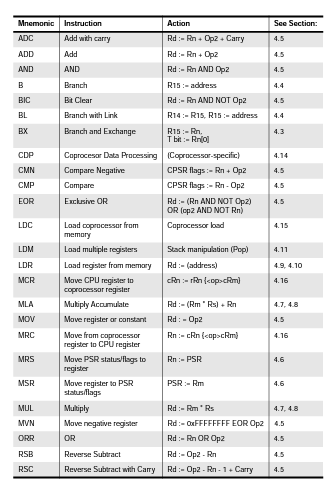
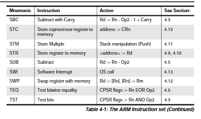

# Assembly Language Programming with ARM  /  Scott Cosentino / Anfang November 23'

[ARMv7_ASR_-Architecture-Reference-Manual](./ARMv7_ASR_-Architecture-Reference-Manual.pdf)
[Syscall Tabelle](https://arm.syscall.sh/)

## Takeaways

+ Wert in Register laden und ADD 4
 `LDR R1,[R0,#4]!`
[Beispeilhafte Erklärung](#einfacher-loop)
R0 wird um 4 erhöht und dann in R! geladen. Ohne dem ! würde der Wert geladen und erhöht.

+ Große Konstanten intitialisieren
Konstanten können nur bis zu einem bestimmten Wert direkt in Register geladen werden. Ist der Wert überschritten, muss man sie mit `.equ` initialisieren und danach in ein Register laden.

```assembler
.equ KONSTANTENNAME, KONSTANTEWERT

.global _start
_start:
    LDR R0,=KONSTANTENNAME
```

+ Take

## OP-CODE / Instruction Set



[ARM-Instructionset.pdf]('./ARM-Instructionset.pdf)

### **SWI Software Interrupt**

Der "SWI" (Software Interrupt) Befehl in der ARM-Assembler-Programmierung wird verwendet, um das Betriebssystem aufzufordern, eine spezifische Aufgabe oder Funktion auszuführen. Dies geschieht, indem in Register r7 ein SVC-Nummerncode platziert wird, der die gewünschte Aktion definiert. Der SWI-Befehl löst dann den Software Interrupt aus, wechselt in den Betriebssystemmodus und führt die entsprechende Funktion aus, abhängig vom übergebenen Nummerncode. Die genauen Funktionen und Codes variieren je nach Betriebssystem und Implementierung.

### **CMP**

`CMP Value1,Value2`

### **LDR Load Register**

`LDR Registername,=listname`

### Branches

#### **BL**

`BL Zieladresse`
Die BL-Anweisung in bewirkt einen Sprung zu einer anderen Stelle im Code (Zieladresse) und speichert gleichzeitig die aktuelle Rückkehradresse im Link Register (LR), um nach Beendigung des aufgerufenen Codes zur richtigen Stelle zurückzukehren. Sie wird oft verwendet, um Funktionen oder Unterprogramme aufzurufen und den Programmfluss zu steuern.

#### **BX (Branch and Exchange)**

`BX lr`: Springe zur Adresse im Linkregister
Das BX-Opcodes ist eine ARM-Assembler-Anweisung, die dazu verwendet wird, den Programmfluss zu einem anderen Bereich des Codes zu verzweigen und gleichzeitig zwischen verschiedenen Ausführungsmodi oder Prozessorzuständen umzuschalten. Es ermöglicht den Übergang zwischen ARM- und Thumb-Modus (oder von einem Modus zu einem anderen).

#### **Verbindung zwischen BL und BX**

Häufig wird `BL` (Branch with Link) in Verbindung mit `BX` verwendet, um Funktionen oder Unterprogramme aufzurufen und den Programmfluss zu ändern. Hier ist, wie sie zusammenarbeiten:

+ `BL` wird verwendet, um...
...zu einer anderen Stelle im Code (einer Funktion oder einem Unterprogramm) zu springen und gleichzeitig die Rückkehradresse im Link Register (LR) zu speichern. Dies ermöglicht es, zur richtigen Stelle im Code zurückzukehren, nachdem das aufgerufene Programm beendet ist.

+ `BX` kann verwendet werden, um...
...den Modus oder Zustand des Prozessors zu ändern, wenn dies erforderlich ist. Zum Beispiel, wenn du von ARM-Modus zu Thumb-Modus wechseln möchtest, um speziellen Thumb-Code auszuführen.

Ein typisches Anwendungsbeispiel könnte so aussehen:

```assembly
BL FunktionA    ; Springe zu FunktionA und speichere Rückkehradresse in LR
...
BL FunktionB    ; Springe zu FunktionB und speichere Rückkehradresse in LR
...
BX LR          ; Springe zur Rückkehradresse im Link Register und wechsle möglicherweise den Ausführungsmodus
```

In diesem Beispiel ruft `BL` zwei Funktionen auf und speichert die Rückkehradressen im Link Register. Dann wird `BX` verwendet, um zum Link Register (LR) zu springen und möglicherweise den Ausführungsmodus zu ändern, wenn die aufgerufenen Funktionen in einem anderen Modus geschrieben sind. Dies ermöglicht eine flexible Steuerung des Programmflusses und des Prozessorzustands.

#### **BAL (Branch and Link)**

`BAL defaultname`

`BAL` ist eine spezielle Anweisung in der ARM-Assembler-Sprache und steht für "Branch and Link." Diese Anweisung wird hauptsächlich für die Implementierung von Funktionen und Unterprogrammen verwendet und hat eine wichtige Rolle in der Steuerung des Programmflusses. Hier ist, was `BAL` bewirkt:

+ "Branch"
Die Anweisung führt einen Verzweigungs-Sprung (Branch) im Programm aus. Das bedeutet, dass das Programm zu einer anderen Stelle im Code springt, die durch eine Adresse oder eine Bezeichnung angegeben ist.

+ "Link"
Das "Link"-Element in `BAL` ist entscheidend. Es bewirkt, dass die aktuelle Rückkehradresse (die Adresse des nächsten auszuführenden Befehls nach `BAL`) im sogenannten "Link Register" (LR) gespeichert wird. Dies ermöglicht es, nach Beendigung der aufgerufenen Funktion oder des Unterprogramms zum ursprünglichen Programmfluss zurückzukehren.

Zusammengefasst: `BAL` ist eine Verzweigungsanweisung, die den Programmfluss zu einer anderen Stelle im Code leitet und gleichzeitig die Rückkehradresse speichert, damit das Programm nach Beendigung des aufgerufenen Codes zur richtigen Stelle zurückkehren kann. Dieses Verhalten macht es zu einer Schlüsselkomponente für die Implementierung von Funktionen und Unterprogrammen in ARM-Assembler.

#### **Unterschied BL zu BAL**

Der Hauptunterschied zwischen `BL` und `BAL` in ARM-Assembler liegt in der Verwendung und den Konventionen:

+ **`BL` (Branch with Link)**
Diese Anweisung wird verwendet, um zu einer anderen Stelle im Code zu springen (Zieladresse) und gleichzeitig die Rückkehradresse im Link Register (LR) zu speichern. Dies ermöglicht das Aufrufen von Funktionen oder Unterprogrammen und die spätere Rückkehr zum ursprünglichen Programmfluss. `BL` ist eine häufig verwendete Konvention in ARM-Assembler.

+ **`BAL` (Branch and Link)**
`BAL` ist eine weniger häufig verwendete Konvention, bei der sowohl der Sprung (Branch) als auch das Speichern der Rückkehradresse (Link) in einer einzigen Anweisung erfolgt. Das bedeutet, dass `BAL` im Grunde genommen die Kombination von `B` (Branch) und `BL` (Branch with Link) ist. Die Verwendung von `BAL` kann in einigen Fällen nützlich sein, ist jedoch weniger verbreitet.

Im Wesentlichen erfüllen sowohl `BL` als auch `BAL` die Funktion des Aufrufs von Funktionen oder Unterprogrammen und des Speicherns der Rückkehradresse. Der Hauptunterschied besteht darin, wie dies in den Assembler-Code integriert ist. Die Wahl zwischen `BL` und `BAL` hängt von den spezifischen Anforderungen deines Programms und deinen Präferenzen ab. `BL` ist die gebräuchlichere und üblichere Variante.

### Vergleichslogik / Comparison logic

#### **BGT (Branch if Greater Than)**

`BGT branchname`
Die "BGT" -Anweisung ist ein bedingter Verzweigungs-Befehl und wird in den meisten ARM-Architekturen unterstützt. Sie ermöglicht es, zu einem anderen Codeabschnitt zu springen, wenn eine bestimmte Bedingung erfüllt ist. In diesem Fall erfolgt der Verzweigungssprung, wenn ein Wert größer als ein bestimmter Schwellenwert ist.

**BGE (Branch if Greater Than or equal to)**
**BLT (Branch if Less Than)**
**BGE (Branch if Less Than or equal to)**
**BEQ (Equals To)**
**BNE (Not Equals To)**
**BEQ** Exit Punkt eines Loops

### Stack

#### **PUSH** 

Die `PUSH`-Anweisung wird verwendet, um Registerwerte auf den Stapel (Stack) zu legen. Dies wird oft verwendet, um den Zustand von Registern vor einem Funktionsaufruf zu speichern, damit sie nach dem Aufruf wiederhergestellt werden können.

#### **POP** 

Die `POP`-Anweisung wird verwendet, um zuvor auf den Stapel gelegte Registerwerte wieder abzurufen und in die entsprechenden Register zu laden. Dies ermöglicht die Wiederherstellung des ursprünglichen Zustands der Register nach einem Funktionsaufruf.

#### **PUSH und POP Erklärung an Beispiel**

In deinem Beispiel wird gezeigt, wie `PUSH` und `POP` verwendet werden, um Registerwerte zu speichern und wiederherzustellen:

```assembler
.global _start
_start:

    MOV R0,#1
    MOV R1,#3
    PUSH {R0,R1}
    BL get_value
    POP {R0,R1}
    B end
 
´get_value:
    MOV R0,#5
    MOV R1,#7
    ADD R2,R0,R1
    BX lr
 
end:
```

1. `_start:` ist der Einstiegspunkt des Programms.
2. `MOV R0,#1` und `MOV R1,#3` setzen die Werte der Register R0 und R1 auf 1 bzw. 3.
3. `PUSH {R0,R1}` speichert die aktuellen Werte von R0 und R1 auf dem Stapel.
4. `BL get_value` ruft die Funktion `get_value` auf.
5. Innerhalb von `get_value` werden die Werte von R0 und R1 auf 5 und 7 gesetzt und in R2 addiert.
6. `BX lr` wird verwendet, um zur Rückkehradresse (Link Register, LR) zurückzukehren, was den Funktionsaufruf beendet und zur nächsten Anweisung nach dem Funktionsaufruf zurückkehrt.
7. `POP {R0,R1}` stellt die zuvor auf dem Stapel gespeicherten Werte von R0 und R1 wieder her.
8. `B end` verzweigt zur `end`-Marke und beendet das Programm.

In diesem Beispiel werden die Werte von R0 und R1 vor dem Funktionsaufruf mit `PUSH` auf dem Stapel gespeichert und nach dem Funktionsaufruf mit `POP` wiederhergestellt, um sicherzustellen, dass der ursprüngliche Zustand der Register erhalten bleibt. Dies ist nützlich, wenn Funktionen Registerwerte ändern und du sicherstellen möchtest, dass sie nach dem Funktionsaufruf wieder im ursprünglichen Zustand sind.

## REGISTER

### **r0 - r6: Allgemeine Verwendung**

Diese Register sind allgemeine Zweckregister und werden oft für temporäre Daten und Parameterübertragung zwischen Funktionen verwendet. In ARM-Assembler-Code können sie vielfältige Aufgaben erfüllen.

### **r7 (auch als r11 in einigen Kontexten bezeichnet)**

Systemaufrufe, die in einem Table hinterlegt sind wie (zb.: 1 steht für Programm beenden) und mehr: r7 wird oft als der "Link Register" verwendet, um die Rücksprungadresse für Funktionen zu speichern, sodass diese zur Aufrufstelle zurückkehren können. Es ist jedoch wichtig zu beachten, dass r7 in einigen Kontexten auch für Systemaufrufe (SWI - Software Interrupts) verwendet wird, um auf bestimmte Betriebssystemfunktionen zuzugreifen. Die Verwendung von r7 hängt stark von der konkreten Anwendung ab. 

### **lr (Link Register)**

Speichert die Adresse zu der eine Funktion zurückgeben soll. Wenn eine Funktion beendet wird, wird der Befehl BX lr (Branch and Exchange with Link Register) verwendet, um zur gespeicherten Adresse zurückzukehren.

### **pc (Program Counter)**

pc ist der Programmzähler, der die Adresse des nächsten auszuführenden Befehls enthält. Er wird automatisch aktualisiert, wenn Befehle ausgeführt werden.

### **cpsr (Current Program Status Register)**

cpsr speichert Informationen über den aktuellen Status des Prozessors, wie beispielsweise Flags, die auf Bedingungen nach Ausführung von Befehlen hinweisen. Diese Flags umfassen das Zero-Flag (Z), das Negative-Flag (N), das Carry-Flag (C), das Overflow-Flag (V) und andere. Es wird verwendet, um Bedingungen in bedingten Sprüngen zu überprüfen.

### **spsr (Saved Program Status Register)**

spsr ist ein Register, das in Verbindung mit Ausnahmebehandlungsroutinen verwendet wird. Wenn eine Ausnahme auftritt, wird der Status des cpsr in das spsr dieses Modus gesichert. Dadurch kann der Prozessor nach Abschluss der Ausnahmebehandlung wieder in seinen vorherigen Zustand zurückkehren.

### **sp (Stack Pointer)**

Der Stack Pointer (SP) ist ein Register oder Zeiger, der auf den aktuellen Speicherort im Stack zeigt. Der Stack wird verwendet, um temporäre Daten zu speichern und den Programmfluss zu steuern. Der SP wird erhöht, wenn Daten auf den Stack gelegt (gepusht) werden, und reduziert, wenn Daten vom Stack entfernt (gepoppt) werden.

```assembly
PUSH {R0, R1}
BL get_value
POP {R0, R1}
```

1. `PUSH {R0, R1}`: Hier werden die aktuellen Werte der Register R0 und R1 auf den Stack gelegt. Der SP wird erhöht, um auf die neuen Speicherpositionen zu zeigen. Dies speichert die aktuellen Werte der Register, damit sie nach dem Funktionsaufruf wiederhergestellt werden können.

2. `BL get_value`: Dies ruft die Funktion `get_value` auf. Während des Funktionsaufrufs wird der SP möglicherweise weiter erhöht, um Platz für lokale Variablen oder andere Werte zu schaffen.

3. `POP {R0, R1}`: Nachdem `get_value` beendet ist, werden die zuvor auf den Stack gelegten Werte von R0 und R1 zurückgeholt. Der SP wird reduziert, um auf die vorherigen Speicherpositionen zu zeigen. Dadurch werden die ursprünglichen Werte der Register wiederhergestellt.

Der Stack Pointer spielt hier eine entscheidende Rolle, um sicherzustellen, dass die Register nach dem Funktionsaufruf ihren ursprünglichen Zustand zurückerhalten. Dies ist wichtig, um die Integrität des Programmflusses und der Registerwerte zu gewährleisten, insbesondere in Funktionen, die Registerwerte ändern.

Wenn man von "erhöhen" und "reduzieren" im Zusammenhang mit dem Stack Pointer (SP) spreche, meine ich die Veränderung des Werts, den der SP anzeigt, um auf den aktuellen Speicherort im Stack zuzugreifen. Hier ist eine genauere Erklärung:

+ **Erhöhen des SP**
Wenn der SP erhöht wird, bedeutet dies, dass er auf eine höhere Speicheradresse zeigt. Das bedeutet, dass der Stack um den angezeigten Wert "nach oben" im Speicher wächst. Bei einer Erhöhung wird der SP verwendet, um auf den nächsten verfügbaren Speicherplatz im Stack zu zeigen.

+ **Reduzieren des SP**
Wenn der SP reduziert wird, bedeutet dies, dass er auf eine niedrigere Speicheradresse zeigt. Das bedeutet, dass der Stack "nach unten" im Speicher schrumpft. Bei einer Reduzierung wird der SP verwendet, um auf den vorherigen Speicherplatz im Stack zu zeigen.

Um das Prinzip zu verdeutlichen, betrachten wir ein einfaches Beispiel:

Angenommen, der SP zeigt zunächst auf die Speicheradresse `0x1000`. Wenn du den SP um 4 erhöhst, zeigt er anschließend auf 0x1004, was bedeutet, dass der Stack um 4 Bytes nach oben im Speicher gewachsen ist.

Wenn du den SP danach um 8 reduzierst, zeigt er auf `0x1000` zurück, was bedeutet, dass der Stack um 8 Bytes nach unten im Speicher geschrumpft ist, und der vorherige Zustand wiederhergestellt ist.

## Basiswissen

### Negativer Zahlen

#### One's and Two's Compliment

**One's Complement:**
Bei der Darstellung von negativen Zahlen im "one's complement" wird das Bitmuster einer negativen Dezimalzahl erzeugt, indem alle Bits der positiven Zahl umgekehrt werden. Das bedeutet, dass 0 zu 1 wird und umgekehrt. Dies führt dazu, dass es zwei Darstellungen für die Null gibt (positiv und negativ). Zum Beispiel wird die Dezimalzahl -3 im "one's complement" als 1110 dargestellt.

**Two's Complement:**
Die "two's complement"-Darstellung ist eine der gebräuchlichsten Methoden zur Darstellung von negativen Binärzahlen. Hierbei wird die Binärzahl negiert (alle Bits umgekehrt) und dann 1 zum Ergebnis hinzugefügt. Das bedeutet, dass es nur eine Darstellung der Null gibt. Zum Beispiel wird die Dezimalzahl -3 im "two's complement" als 1101 dargestellt.

**Der Unterschied zwischen beiden liegt in der Darstellung der Null und in der Art und Weise, wie Überträge behandelt werden.** Bei "one's complement" gibt es eine negative und eine positive Null, während bei "two's complement" nur eine Null existiert. "Two's complement" hat den Vorteil, dass arithmetische Operationen wie Addition und Subtraktion natürlicher ablaufen, da es nur eine Null gibt und keine speziellen Regeln für das Behandeln von Überträgen notwendig sind.

## Beispiele

### Loops

#### Einfacher Loop

```assembly
.global _start
.equ endlist, 0xaaaaaaaa ;Konstante
_start:
    LDR R0,=list ;Liste in R0 laden
    LDR R3,=endlist ;Konstant in R3 laden
    LDR R1,[R0] ;Listenwert von Index 0 in R1 laden
    ADD R2,R2,R1 ;R1 zu R2 addiern und speichern
loop:
    LDR R1,[R0,#4]! ;Lädt den Wert aus dem Speicher an Adresse R0 + 4 in Register R1 und erhöht R0 automatisch um 4.
    CMP R1,R3 ;R1 und R3 vergleichen
    BEQ exit ;Aus Loop aussteigen
    ADD R2,R2,R1 ;R1 zu R2 addiern und speichern
    BAL loop ;
    
exit:

.data
list:
    .word 1,2,3,4,5,6,7,8,9,10
```

Dieser ARM-Assembler-Code ist ein einfaches Programm, das eine Liste von Zahlen in einem Speicherbereich durchgeht und die Summe dieser Zahlen berechnet. Hier ist eine schrittweise Erklärung:

1. `.global _start`: Dies definiert das Label `_start` als global, was bedeutet, dass es der Einstiegspunkt des Programms ist.

2. `.equ endlist, 0xaaaaaaaa`: Hier wird eine Konstante mit dem Namen `endlist` definiert und auf den Wert `0xaaaaaaaa` gesetzt.

3. `_start:`: Dies ist das Label, das den Beginn des Programms markiert.

4. `LDR R0,=list`: Lädt die Adresse der Liste (im Speicher) in das Register R0.

5. `LDR R3,=endlist`: Lädt den Wert der Konstanten `endlist` in das Register R3.

6. `LDR R1,R[0]`: Lädt den Wert aus der Speicheradresse, die in R0 gespeichert ist, in das Register R1.

7. `ADD R2,R2,R1`: Addiert den Wert in R1 zu dem Wert in R2 und speichert das Ergebnis wieder in R2. Dies wird verwendet, um die Summe der Zahlen zu berechnen.

8. `loop:`: Dies ist ein Label, das den Beginn einer Schleife markiert.

9. `LDR R1,[R0,#4]!`: Lädt den Wert aus dem Speicher an der Adresse, die sich 4 Bytes (32 Bit) nach der im Register R0 gespeicherten Adresse befindet, in das Register R1. Das `!` bewirkt, dass R0 nach dem Laden um 4 erhöht wird, um auf die nächste Zahl in der Liste zuzugreifen.

10. `CMP R1,R3`: Vergleicht den Wert in R1 mit dem Wert in R3.

11. `BEQ exit`: Wenn die beiden Werte gleich sind (Equal), springt das Programm zur Marke `exit`, was bedeutet, dass die Schleife beendet wird.

12. `ADD R2,R2,R1`: Addiert den Wert in R1 zur bisherigen Summe in R2.

13. `BAL loop`: Dies ist ein Verzweigungs-Befehl, der zur Marke `loop` zurückkehrt, um die Schleife fortzusetzen.

14. `exit:`: Dies ist das Label, das das Ende des Programms markiert.

15. `.data`: Hier beginnt der Abschnitt für Daten.

16. `list:`: Dies ist das Label für die Liste der Zahlen.

17. `.word 1,2,3,4,5,6,7,8,9,10`: Hier werden die Zahlen in der Liste als Worte definiert.

Das Programm lädt nacheinander die Zahlen aus der Liste, addiert sie zur Summe und überprüft, ob das Ende erreicht ist. Sobald das Ende der Liste erreicht ist, wird das Programm beendet, und die Summe der Zahlen wird in Register R2 gespeichert.
