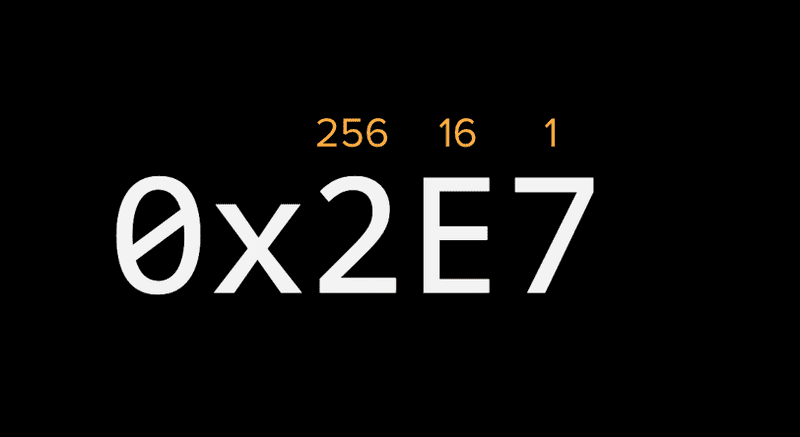

# WebAssembly / Jem Young (Senior Dev, Netflix) / Anfang September

[Kurswebsite](https://young.github.io/intro-to-web-assembly/https://young.github.io/intro-to-web-assembly/)

## Takeaways

+
+
+

## 1. Hexadecimal

Hexadezimal verwendet die Basis 16 zur Berechnung von Bytewerten und die Buchstaben A bis F repräsentieren jeweils die Zahlen 10 bis 15.

| Decimal 	| Hexadecimal 	|
|:-------:	|:-----------:	|
| 0       	| 00          	|
| 1       	| 01          	|
| 2       	| 02          	|
| ..      	| ..          	|
| 9       	| 09          	|
| 10      	| 0A          	|
| 11      	| 0B          	|
| 12      	| 0C          	|
| 13      	| 0D          	|
| 14      	| 0E          	|
| 15      	| 0F          	|
| 16      	| 10          	|
| 17      	| 11          	|
| 18      	| 12          	|

+ 
+
+

## 2.

+
+
+

## 3.

+
+
+
