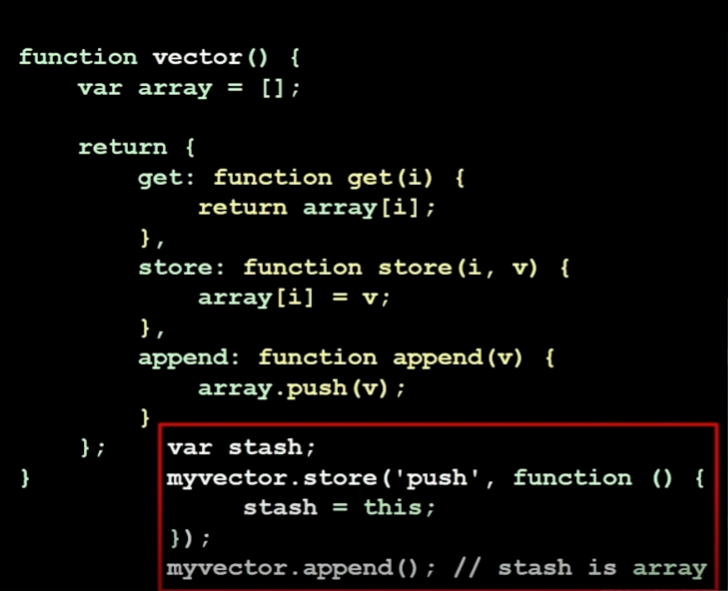

# The Good Parts of Javascript and the Web / Douglas Crockford (Paypal) / Mitte August, 23`

## Loops: *for*, *forEach*, *every*

### *for*

Einen *for*-Loop kann man mit `break;` abrechen. Eine Iteration überspringt man mit `continue`. 

### *forEach*

Mit `forEach` kann man nur mit *return* aus der aktuellen Iteration ausbrechen, die Verarbeitung der anderen Elemente findet jedoch statt:

```
const array = [1, 2, 3, 4, 5];

array.forEach(item => {
    if (item === 3) {
        return; // Verarbeitung für dieses Element überspringen
    }
    
    console.log(item);
});
```

### *every*

Mit `.every` kann man *expessions* nutzen um einen Loop abzubrechen:

```
const array = [1, 2, 3, 4, 5];
let shouldBreak = false; // optional um den Status des Loops zu tracken

array.every(item => {
    if (item === 3) {
        shouldBreak = true; // optional um den Status des Loops zu tracken
        console.log("Loop wurde vorzeitig abgebrochen."); // optional
        return false; // Der Loop wird vorzeitig abgebrochen
    }
    
    console.log(item);
    return true; // Der Loop wird fortgesetzt
});

```

## *Numbers*

+ In JS gibt es keine Integer, nur 64-Bit floating Number (Double)

## Booleans and Strings

+ Strings sind einer oder eine Sequenz von 16-Bit Unicode Characters
+ Präfix konvertiert einen String in eine Nummer: +str
+ Strings sind 16-Bit Characters

## Arrays

+ Arrays erben von Object.
+ Objekt-Indexe werden in einen String geparst.

## Statements
+ break, for in, switch, throw, try/catch
+ Statements können Labels haben 

`break` statements können zu Lables referenzieren: 
```
LABEL for (let i =......) {
            ....
            if (...){
                break LABEL;
            }
}
```
## Functions

Funktionen erben von `Function.prototype`, sind JS-Objekte und Werte (em.: values), die in Variablen gespeichert werden können. In JavaScript, es gibt zwei Hauptweisen, wie Funktionen erstellt werden können: Function Statements und Function Expressions. Diese beiden Ansätze haben Unterschiede in der Art und Weise, wie sie erstellt und gehandhabt werden.

### Function Statement

Ein Function Statement ist die klassische Art und Weise, eine Funktion in JavaScript zu erstellen. Hier wird die Funktion mit dem Schlüsselwort "function" erstellt, gefolgt von einem zwingend erforderlichen Namen und den Parameterklammern:

```
function add(a, b) {
  return a + b;
};
```

In einem Function Statement ist der Funktionsname obligatorisch und die Funktion ist bereits vor der Ausführung des umgebenden Codeblocks verfügbar. Dies wird als "Named Function Hoisting" bezeichnet, weil die Funktion im Voraus deklariert wird, bevor der eigentliche Code ausgeführt wird. Der JS-Interpreter wandelt ein function statment intern wie folgt um:

```
function add(){...}
```
...wird zu...
```
var add = function add(){...}
```

### Function Expression

Eine Function Expression erstellt eine Funktion und weist sie einer Variable zu. Dies wird oft verwendet, um anonyme Funktionen zu erstellen oder um Funktionen als Werte in Variablen, Objekten oder Arrays zu speichern:

```
const subtract = function(a, b) {
  return a - b;
};
```
### Parameter

+ Extra Argumente werden ignoriert, fehlen Argumente sind sie undefined.
+ 2 Pseudo-Paramter:
    + `arguments` ist ein Array-ähnliches JS-Objekt, dass alle Argumente sammmelt, selbst wenn keine Parameter definiert wurden. Mit `arguments.length` bekommt man die Anzahl der Argumente (zb.: zum iterieren).
    + `this` hält eine Referenz zum aufgerufenen Objekt.

### Closure und IIFE

```
var digit_name = function(n) {
    var names = ['eins', 'zwei', 'drei',....];

    return names[n];
}
alert(digit_name(3));   // 'three/
```
Das Problem an diesem Beispiel ist, jedes Mal wenn `digit_name()` gecallt wird, muss ein neuer Array `names` erstellt werden. Dies kann man verhindern:

```
var digit_name = (function() {
    var names = ['eins', 'zwei', 'drei',....];

    return function(n){
        return names[n];
    };
}();
alert(digit_name(3));   // 'three/
```

Hier wird in `digit_name` nicht die äußere Funktion, sonder die zurückgegebene innere gespeichert und diese hat Zugriff auf den lokalen Speicher des Ausführungskontexts der äußeren Funktion, welche nur einmal, bei der Funktionszuweisung, gecallt wird.

## Objekte

+ `Objekt.create(null)` erbt nicht von `Object.prototype` (es erbt von nichts). Dies kann man nutzen, um wie in einem Hashtable Key=value zu Paare zu speichern
+ Ein Nachteil von Klassen-Orientierten Systemen ist, dass man zu Beginn eines Projektes die Klassen taxonomieren muss, also festlegen wie sie aussehen und was wovon erbt. und das zu einen Zeitpunkt, zu Beginn, bei dem man noch am allerwenigsten darüber weiß wie die Klassen zum Schluss aussehen werden.

### constructor

+ Konstruktorfunktion ohne *this*:
Die Funktion *constructor* ertellt ein Objekt, indem sie zuerst einen anderen Konstruktor aufruft, das erstellte Objekt um zusätzliche Eigenschaften und Methoden erweitert und schließlich das erweiterte Objekt zurückgibt.

```
function constructor(init) {
    const that = other_constructor(init),
        member,
        method = function() {
            // init, member, method
        };
    that.method = method;
    return that;
};
```

## Sicherheitsrisiken

### Prototype

In JS kann man den Prototypen eines exisitierenden Objekts verändern und damit zb.: Methoden so umschreiben, dass sie Werte beim aufrufen zurückgeben.

```
function smt(){
    let array = [...]
};
smt.prototype.  // ...etwas dem Prototypen hinzufügen
```

### Array/Vektor/Functions

In Javascript stellen generell Objekte, die ein Objekt zurückgeben, welcher man wiederum eine Funkion übergeben kann eine Sicherheitslücke dar. Oft werden letztgenannte Funktionen in zb.: Objektinterne-Arrays eingebaut weil man annahm, das eine Zahl oder ein String, keine Funktion übergben werden würde. Diese Funktionen haben aber Zugriff auf den *lokalen Speicher* des Objekts. Für sie ist es oft möglich Daten zu verändern, Daten ungewollt auszugeben (zb.: mit `this`) oder Methoden am Objekt zu implementieren.

Arrays in Kombinationen mit Objekten und *this* können Sicherheitsrisiken darstellen:

```
function vector(){
    let array = ['Will ich haben!'];
    return {
        get: function get(i) {
            return array[i];
        },
        store: function store(i, v){
            array[i] = v;
        },
        append: function append(v) {
            array.push(v);
        }  
    };
};
```



Hier wird eine globale Variable *stash* erstellt. Auf ein Vektorobjekt wird die Methode `store` aufgerufen uns der *String* `push`  mitsamt einer einer anonymen Funktion übergeben, in welcher `stash = this`, also *this* auf die globale Variable gebunden wird. Nun wird substituirt:
`array[i]` fügt den index `push` in den Array ein.
Wie wird `push` nun auf `array` angewandt, damit die `stash` Variable eingefügt wird? Ruft man `.append()` auf wird die Methode `array.push()` und da vorher mit `.store('push'...)` eine neue Methode `push` in den Array geschrieben wurde, wird diese aufgerufen. `stash = this` this zeigt nun auf den Array und damit ist `stash === this === array`

Dieses Risiko kann man eliminieren, wenn man in der `get(i)`-Methode das Argument zwingend mit `+`-Prefix zu einem *Integer* *parsed*:
```
    ...
    return {
        get: function get(i) {
            return array[+1];dfd
        },
    ...
```
Wenn man weiß, dass man ausschließlich einen *Integer* benötigt, sollte man dies immer machen! 

### Objekte einfrieren

Bei Objekten, egal ob normale oder über Konstrukturfunktionen zurückgegebene, kann man sicherstellen, dass keine Methodend oder Member mehr von außen verändert werden können:

```
function anyth(){
    return Object.freeze(
        ....
    )
};
```
Das Problem ist, das selbst mit *const* initialisierte komplexe Datentypen wie *Object* die Werte des Objekts verändern werden können. Bei `const obj = {let a = 1};` ist lediglich Die Variable `obj` vor Veränderung geschützt, nicht `a`.
Die Regel lautet hier: `const` macht Variablen *unmutable*, *freezing* macht Werte *unmutable*. 
(*Funktionen* und *Objekte* sind ggf. auch Werte!)
Obacht! `Object.freeze()` kann nicht rückgängig gemacht werden! Als ALternative kommt möglicherweiße das Arbeiten mit einer Kopie des Objekts infrage, wenn man es schützen möchte.

## Tools und things of interest:

+ Referent erklärt, dass eine Variable die man nicht initialisiert von JS automatisch mit undefined initialisiert wird.
+ `.forEach()` kann for Loops sehr oft ersetzen.
+ Destructing nutzen, denn es spart Codezeilen: `const {a, b} = {a: 44, b: 21};`
+ Tools
    + RQ.js-Bibliothek für das arbeiten mit Servern. APIs und anderen Ressourcen
    + js-check.js, jest oder mocha für testing
    + Regulex ist ein Toll in welches man Regex eingeben kann und man gezeigt bekommt, was dieses Regex macht: [regulex](https://www.jex.im/regulex)

