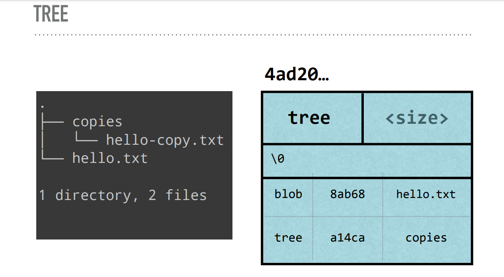

# GitInDepth / Nina Zakharenko ||| Mitte Aug, 2023

+ Git teilt die Arbeitsumgebung in drei Bereiche: ***Working area*** (untracked files), ***Staging area*** (added files), ***Repository*** (*commit*ed files).

+ Mit dem CLI-Tool ***tree*** kann man Git Repositories gut darstellen: `tree .git` 

+ In Git wird der content in SHA1 gehashed:
    + Git anweisen, aus Daten einen SHA1 Hash zu erstellen und auszugeben: 
        + `echo 'Hello, World!' | git hash-object --stdin`
    + Git anweisen, aus einem Daten + Metadaten (zb.: eines **blobs**) einen SHA1 Hash herzustellen:
        + `echo 'blob 14\0Hello, World!' | openssl sha1`
    + Git anweisen, den Inhalt eines Hashs auszugeben:
        + `git cat-file -p 980a0` (wobei 980a0 der Hash ist und hier beispielhasft eingefügt ist)

## Git-Objekte

Es gibt Git-Objekte wie  **blobs**, **commit**s und **trees**. In beiden werden Headerinformation sowie der Content mit einem SHA-1 Hash gespeichert. Außerdem gibt es mit \0 delimiter um die Daten zu trennen. 
    
+ ****blob****: In Blob's speichert Git komprimierte Daten zusammen mit Metadaten (im Header). Die Objektstruktur ist wie folgt:
        + Identifier blob
        + Größe des contentas
        + \0 delimiter
        + content 
        + 
    + Im *blob* werden aber weder Dateinamen noch Ordnerverzeichnisstrukturen abgespeichert! Dies geschieht in einem Tree-Objekt.

+ ***Tree***: 
    + Pointer: Zu **blobs** & anderen **trees** als SHA1
    + Metadaten: Pointertyp (blob oder tree), Datei- oder Verzeichnisname und Modus (Executable, symbolic link,..) als String
    + x
+ **trees** zeigen auf **blobs** und andere Tree-Objekte

+ ***Commmit***: Ein *commit* zeigt auf einen tree und enthält folgende Metadaten:
    + Autor und *commit*ter
    + Datum
    + Nachricht
    + Parent *commit* (eines oder mehrere)
+ Der SHA1 von einem *commit* ist der hash von alle diesen Informationen
+ 
+ Ein *commit* zeigt auf parent-commits und andere trees
+ EIn *commit* ist ein "Code Snapshot", eine Momentaufnahme des Codes zu einer bestimmten Zeit.

+ In Git werden identische Daten - also ein identischer Hash - nur einmal abgespeichert, egal wie oft dies vorkommt. 
+ Git speichert in .git/objects diese Objekte ab. Diese werden in Subfolder gereiht, die nach den ersten beiden SHA1-Symbolen benannt sind, also zb.: 8P, 0U, TT usw... Alle Hashes die mit demselben beiden Symbolen beginnen, kommen in den gleichen Folder. Diese Prefixe werden bei diesen Objektnamen dann weggellassen.
+ Git-Objekte werden komprimiert. Der Inhalt der Dateien bleibt meistens gleich und deswegen kann Git Dateien zusammen in sogennanten Packfiles komprimieren. 

## Packfiles & HEAD

+ Packfiles speichern Objekte und "Deltas", die Differenz zwischen verschiedenen Versionen einer Datei.
+ Packfiles werden erstellt wenn man zuviele Objekte hat, während gc oder einem push to remote.
+ In .git/HEAD wird der Pointer gespeichert, welcher zum current *branch*e zeigt, 
    + Erstellt man einen neuen *branch*e so wird auch der HEAD Pointer zu diesen zeigen

## Git-Stash

Speichert un-*commit*ed Dateien. Der stash (und die Dateien in ihm)  wird vor destruktiven Operationen (wie löschen, überschreiben, checkout,...) geschützt. Default ist, dass nur tracked files im stash gespeichert werden.

## cat-file

+ `git cat-file -t` -> Gibt Git-Objekt Typ aus.
+ `git cat-file -p` -> Gibt *content* des Objekts aus.

## Git Referenzen

Referenzen sind Pointers auf *commit*s. In Git gibt es 3 Referenzen: Tages & Annotated Tag, *branch*es und HEAD.
+ `tree .git/refs` -> Gibt alle Referenzen aus.
+ `git show-ref --heads` -> Zeigt wohin alle **commit*s* zeigen. Sollte jeweils eines für jeden eigenen und für jeden remote **branch** sein. 

### *branch*

+ Eine *branch* ist ein Pointer auf ein definiertes *commit*-Objekt.
+ Der Pointer von *current branch*' ändert sich mit jedem neuen *commit*.

### HEAD

+ HEAD ist ein Pointer, der auf den Namen des aktuellen *branch* zeigt
+ `cat .git/HEAD` oder `git branch` -> Zeigt an wo die HEAD-Variable hinzeigt

### Tags

+ Es gibt 'lightweight tags', die nur den *commit* markieren udn 'annottated tags', die Author, Datum und eine Nachricht zur MArkierung hinzufügen. 
+ Mit Tags kann man Zeitpunkte wie Meilensteine markieren und später dann leicht wieder zu diesen *commit*-Objekten zurückfinden. 
+ Stellt man einen Tag her werden die gesamten Dateien auf das mit dem Tag markierten *commit* zurückgesetzt.


## Git Kommandos

+ HEAD-Pointer anzeigen: `cat .git/HEAD`
+ Cache aktualisieren (wie 'fetch' bei GH-Desktop-App), wenn man weiß dass *commit*s da sein müssten, ein pull aber nicht möglich ist:
```
git fetch --all
git reset --hard origin/branchname
```

### Tags

+ Alle tags zeigen: `git tag`
+ Tags liste und *commit* zeigen, auf das es pointet: `git show-ref --tags`
+ Tag: `git tag TAGNAME`
+ A-Tag: `git tag -a TAGNAME -m "MESSAGE"`

### stash

+ stash changes: `git stash`
+ stash listen: `git stash list`
+ stash zeigen: `git stash show stash@{0}` (Stashnummer)
+ untracked files stashen: `git stash --include-untracked`
+ stash benennen: `git stash save "..."`

###  staging area

+ Interaktives staging: `git add -p ?`
+ staging index lookup: `git ls-files -s`
+ Datei zu *commit* hinzufügen: `git add <file>`
+ Datei im nächsten *commit* löschen: `git rm <file>`
+ Datei im nächsten *commit* umbenennnen: `git mv <file>`

### *commit*

+ staging überspringen: `git commit -a`
+ Alle Dateien stagen und *commit*en: `git commit -am '...'`
+ Zeigt den Objekttypen an: `git cat-file -t *ersten 4 SHA1 Symbole einfügen*`

### log & show

+ Zeigt alle *commit*s: ´git log´
+ Zeigt *commit* mit content: `.git show <commit>`  
+ Zeigt die letzten zwei **commit*s*: `git log -2 --oneline`
+ Flags: 
    + `--stat`: zeigt de Veränderungen im *commit* 
    + `<commit:<file>`: Auf die Datei von einem ander commit aus schauen
    + ...
+ Zeigt detaillierte Informationen übe einen **commit**: `git show <HASH>`

### diff

Zeigt Veränderungen zwischen 
+ *commit*s
+ zwischen staging area 
+ repository sowie was in der staging area enthalten ist
+ unstaged diffs: `git diff`
+ staged diffss: `git diff --staged`

### branch

+ Zu einem anderen *branch* wechseln: `git checkout <Name>`
+ Kopie des aktuellen *branch* erstellen ohne *checkout* (vor jeden *rebase*, *merge*, *fixup*, *squash* und *reorder* zu empfehlen!): `git branch <Name>`
+ Zeigt mit *master merged* *branch*es die gelöscht werden können:  `git branch -merged master`
+ Zeigt welche *branch*es noch nicht mit *master merged* sind: `git branch --nno-merged master`

### ammend & rebase

Mit *amend* kann man Dateien zum letzten *commit* hinzufügen. Der SHA1 des commits ändert sich jedoch, da ein neuer content einen neuen Hash verursacht. Effektiv erstellt man also einen neuen commit mit zusätzlichen Dateien, alle Metadaten bleiben dieselbigen. Der 'alte' commit wird aufgeräumt.
+ `git add <file> && git *commit* --ammend`

Mit *rebase* kann man einen feature branch mit dem main branch auf eine spezielle Weiße mergen: Man zieht die aktuelle Version des *master *branch*e* und *commit* die Änderungen im *feature Branch* 'on top'. Anders gesagt: Man commited seinen aktuellen Branch und gibt ihm einen neuen *parent*.

### merge vs rebase

**Git Merge:**

```
  A---B---C feature
 /
D---E---F---G master

Beim Mergen von feature in master würde dies zu einem neuen merge-commit führen:

  A---B---C feature
 /         \
D---E---F---G---M master

```

*git merge* ist eine Methode, um Änderungen aus einem *branch* in einen anderen zu integrieren. Wenn man *git merge* verwendet, erstellt Git einen neuen *commit*, der die Änderungen beider Branches zusammenführt. Dieser *commit* hat normalerweise zwei Eltern-*commit*s, die die Vorgänger der zusammengeführten Branches sind. Dies führt zu einem verzweigten Verlauf der Commits.

Vorteile von *git merge*:

+ Bewahrt die ursprüngliche Historie beider *branch*es.
+ Einfacher und direkter Ansatz für das Zusammenführen von Änderungen.
+ Gute Wahl, wenn man eindeutig getrennte Features oder Änderungen hat.
Hat sich der *main* seit dem branchen nicht verändert nennt man denn *merge fast forward*. In diesem Fall werden die Änderungen des *feature branch *commit*ed* und *main* zeigt dann auf diesen *commit*. Zu lösende Konflikte kann es keine geben.


**Git Rebase:**

```
  A---B---C feature
 /
D---E---F---G master

Beim Rebasing von feature auf master würde die commit-Historie geändert:

                  A'--B'--C' feature
                 /
D---E---F---G master

```

**git rebase** ist eine Methode, um die **commit**-Historie zu ändern, bevor man Änderungen in einen anderen *branch* integriert. Wenn man *git rebase* verwendet, verschiebt man commits so, dass sie direkt auf den letzten commit des Ziel-Branches folgen. Dies führt zu einem linearen *commit*-Verlauf, bei dem es aussieht, als ob man direkt auf dem Ziel-Branch gearbeitet hat.

Vorteile von *git rebase*:

+ Schafft einen linearen und sauberen **commit**-Verlauf.
+ Kann nützlich sein, um Konflikte frühzeitig zu lösen, da man *commit*s schrittweise anwendet.
+ Hilfreich, um Änderungen zu organisieren und *commit*s zu kombinieren oder zu teilen.
+ *rebase* reset: `git reset <Name> --hard`
+ Generell sollte man idealerweiße so oft es geht **commit*en*. Um dabei nicht die *history* des *master branch* zu überfluten ist *rebase* ideal.

### clean

**!clean kann nicht rückgängig gemacht werden!**
+ Was würde gelöscht werden: 
    + Dateien: `git clean --dry-run`
    + Verzeichnisse: `git clean -d --dry-run`
+ Löschen:
    + Dateien: `git clean -f`
    + Verzeichnische: `git clean -d`
    + Dateien & Verzeichnische: `git clean -d -f`

### checkout, reset, revert, ammend 

+ *branch* wechseln: `git checkout <NAME>`
+ Änderungen einer Datei zurücksetzen: `git checkout -- <DATEINAME>`
+ Datei zurückholen, welche bei einem *commit* gelöscht wurde bzw wenn noch vorhanden, auf damaligen Zustand setzen: `git checkout <COMMITHASH>^ -- <DATEINAME>` (^ nach Hash da man den *commit* zuvor möchte)
+ Änderungen in der *stage area* überschreiben (Vorsicht, nicht gestashde Änderungen sind unwiderbringlich weg!) -> `git reset --hard`
+ HEAD auf bestimmten **commit** zeigen lassen (Vorsicht!): `git reset <COMMITHASH>`
+ Mit diesem Kommando kann man wieder auf den ursprünglichen **commit** zurück: `git reset ORIG_HEAD`
+ *revert* macht den letzten **commit** rückgängig, jedoch dokumentiert.: `git revert <COMMITHASH>`
+ *amend* macht die letze **commit** Nachricht veränderbar: `git commit --amend`

Git behält **commit*s* ungefähr 2 Wochen lang, danach ist es nicht mit in den Referenzen zu finden. Muss man weiter zurückgehen, kann man dies mit *reflog* erledigen, wobei die Syntax etwas anders ist, wenn man tiefer eintaucht (siehe Website). Man kann reflog wie folgt aufrufen: `git reflog`

## CLI-Tool ***less*** Kommandos

+ f = for next page
+ b = for previous page
+ /<query>
+ n = next match
+ p = previous match
+ To quit:
+ q = to quit
+ less manual page: [less man page](https://linux.die.net/man/1/less)

## rerere 

Tool zur leichteren & sichereren Konfliktlösung bei `git merge` & `git rebase` (.git Verzeichniss wird jedoch größer, da die individuellen Konfliktlösungen aufgezeichnet und gespeichert werden): 
+ Für aktuelles Projekt: `git config rerere.enabled true` 
+ Für alle Projekte: `git config --global rerere.enabled true`
+: rerere-Dateien anzeigen / löschen -> `git rerere` 
