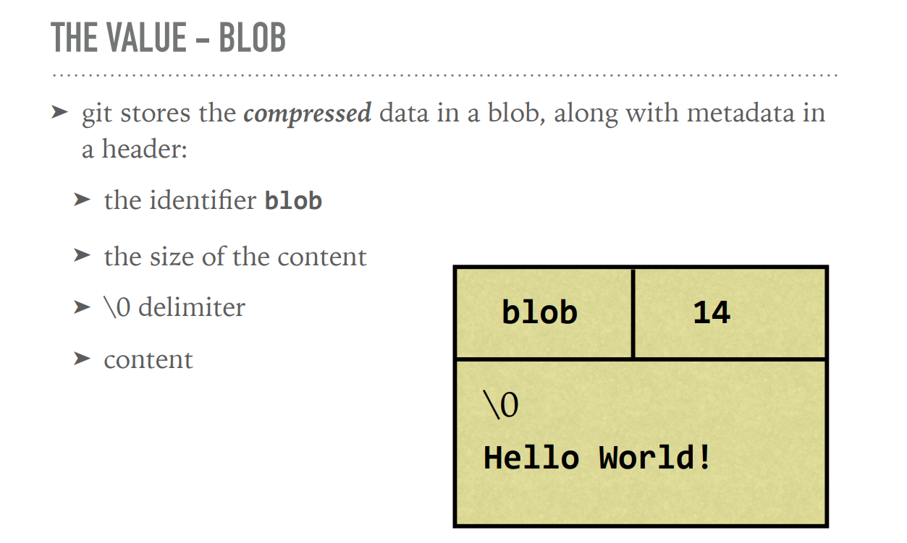
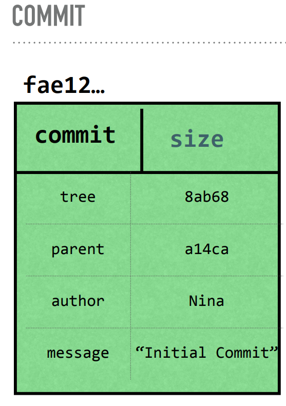

# GitInDepth / Nina Zakharenko

+ Git teilt die Arbeitsumgebung in drei Bereiche: ***Working area*** (untracked files), ***Staging area*** (added files), ***Repository*** (commited files).

+ Mit dem CLI-Tool ***tree*** kann man Git Repositories gut darstellen -> `tree .git` 

+ In Git wird der content in SHA1 gehashed:
    + Git anweisen, aus Daten einen SHA1 Hash zu erstellen und auszugeben: 
        + `echo 'Hello, World!' | git hash-object --stdin`
    + Git anweisen, aus einem Daten + Metadaten (zb.: eines Blobs) einen SHA1 Hash herzustellen:
        + `echo 'blob 14\0Hello, World!' | openssl sha1`
    + Git anweisen, den Inhalt eines Hashs auszugeben:
        + `git cat-file -p 980a0` (wobei 980a0 der Hash ist und hier beispielhasft eingefügt ist)

## Git Objekte

Es gibt Git-Objekte wie  Blobs, Commits und Trees. In beiden werden Headerinformation sowie der Content mit einem SHA-1 Hash gespeichert. Außerdem gibt es mit \0 delimiter um die Daten zu trennen. 
    
+ ***Blob***: In Blob's speichert Git komprimierte Daten zusammen mit Metadaten (im Header). DOe Objektstruktur ist wie folgt:
        + Identifier "Blob"
        + Größe des contentas
        + \0 delimiter
        + content 
        + 
    + Im Blob werden aber weder Dateinamen noch Ordnerverzeichnisstrukturen abgespeichert! Dies geschieht in einem Tree-Objekt.

+ ***Tree***: 
    + Pointer: Zu Blobs & anderen Trees als SHA1
    + Metadaten: Pointertyp (blob oder tree), Datei- oder Verzeichnisname und Modus (Executable, symbolic link,..) als String
    + x
+ Trees zeigen auf Blobs und andere Tree-Objekte

+ ***Commmit***: Ein commit zeigt auf einen tree und enthält folgende Metadaten:
    + Autor und committer
    + Datum
    + Nachricht
    + Parent commit (eines oder mehrere)
+ Der SHA1 von einem commit ist der hash von alle diesen Informationen
+ 
+ Ein commit zeigt auf parent-commits und andere trees
+ EIn commit ist ein "Code Snapshot", eine Momentaufnahme des Codes zu einer bestimmten Zeit.

+ In Git werden identische Daten - also ein identischer Hash - nur einmal abgespeichert, egal wie oft dies vorkommt. 
+ Git speichert in .git/objects diese Objekte ab. Diese werden in Subfolder gereiht, die nach den ersten beiden SHA1-Symbolen benannt sind, also zb.: 8P, 0U, TT usw... Alle Hashes die mit demselben beiden Symbolen beginnen, kommen in den gleichen Folder. Diese Prefixe werden bei diesen Objektnamen dann weggellassen.
+ Git-Objekte werden komprimiert. Der Inhalt der Dateien bleibt meistens gleich und deswegen kann Git Dateien zusammen in sogennanten Packfiles komprimieren. 

## Packfiles & HEAD

+ Packfiles speichern Objekte und "Deltas", die Differenz zwischen verschiedenen Versionen einer Datei.
+ Packfiles werden erstellt wenn man zuviele Objekte hat, während gc oder einem push to remote.
+ In .git/HEAD wird der Pointer gespeichert, welcher zum current Branche zeigt, 
    + Erstellt man einen neuen Branche so wird auch der HEAD Pointer zu diesen zeigen

## Git Stash

Speichert un-commited Dateien. Der stash (und die Dateien in ihm)  wird vor destruktiven Operationen (wie löschen, überschreiben, checkout,...) geschützt. Default ist, dass nur tracked files im stash gespeichert werden.

## Git Referenzen

Referenzen sind Pointers auf commits. In Git gibt es 3 Referenzen: Tages & Annotated Tag, Branches und HEAD.

### Branch

+ Eine Branch ist ein Pointer auf ein definiertes commit Objekt.
+ Der Pointer von 'Current Branch' ändert sich mit jedem neuen commit.

### HEAD

+ HEAD ist ein Pointer, der auf den Namen des aktuellen Branch zeigt

### Tags

+ Es gibt 'lightweight tags', die nur den commit markieren udn 'annottated tags', die Author, Datum und eine Nachricht zur MArkierung hinzufügen. 
+ Mit Tags kann man Zeitpunkte wie Meilensteine markieren und später dann leicht wieder zu diesen commit-Objekten zurückfinden. 
+ Stellt man einen Tag her werden die gesamten Dateien auf das mit dem Tag markierten commit zurückgesetzt.

## Git Kommandos

+ HEAD-Pointer anzeigen -> `cat .git/HEAD`

## Tags

+ Alle tags zeigen -> `git tag`
+ Tags liste und commit zeigen, auf das es pointet -> `git show-ref --tags`
+ Tag -> `git tag TAGNAME`
+ A-Tag -> `git tag -a TAGNAME -m "MESSAGE"`

## stash

+ stash changes -> `git stash`
+ stash listen -> `git stash list`
+ stash zeigen -> `git stash show stash@{0}` (Stashnummer)
+ untracked files stashen -> `git stash --include-untracked`
+ stash benennen -> `git stash save "..."`

##  staging area

+ Interaktives staging -> `git add -p ?`
+ staging index lookup -> `git ls-files -s`
+ Datei zu commit hinzufügen -> `git add <file>`
+ Datei im nächsten commit löschen -> `git rm <file>`
+ Datei im nächsten commit umbenennnen -> `git mv <file>`

### commit

+ staging überspringen -> `git commit -a`
+ Alle Dateien stagen und commiten -> `git commit -am '...'`
+ Zeigt den Objekttypen an -> `git cat-file -t *ersten 4 SHA1 Symbole einfügen*`

## CLI-Tool ***less*** Kommandos

+ f = for next page
+ b = for previous page
+ /<query>
+ n = next match
+ p = previous match
+ To quit:
+ q = to quit
+ less manual page: [less man page](https://linux.die.net/man/1/less)

