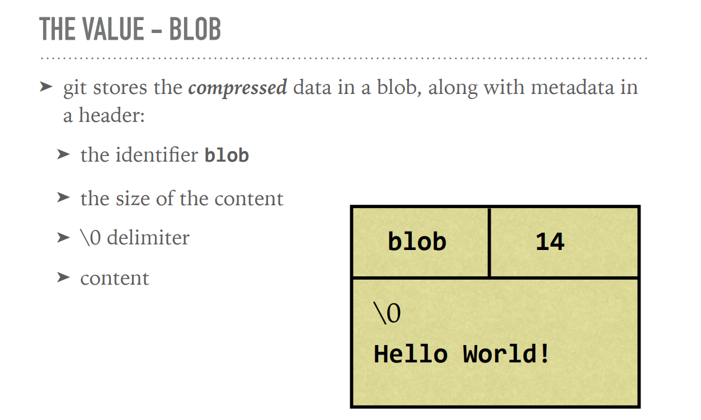
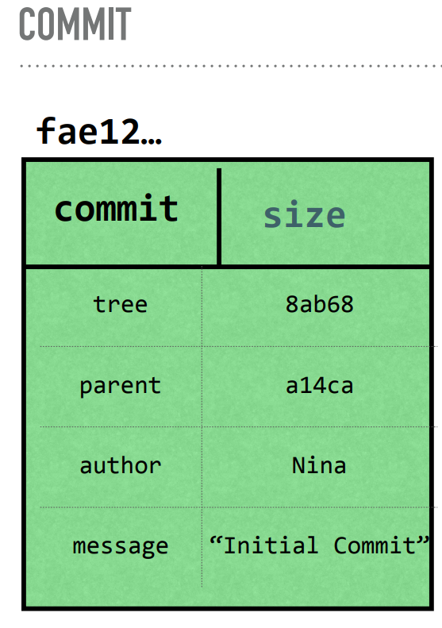

# Allgemeine Notizen

## Javascript

+ LocalServer ist das emulieren einer Website, damit lokale Pfade für Ressourcen funktionieren (CORS)
+ Chrome Workspaces: index.html öffnen und dann Projektfolder reinziehen, dann kann man im Browser arbeiten und die Dateien lokal verändern
+ Javascript kann man über iframes ausführen

## Search Engine Optimation

+ Suchmaschinen ranken dich umso höher, wenn: Eine Website auf dich verlinkt, die viel Einfluss hat und selbst wenig verlinkt.
+ Facebook Open Graph Tags: Canonical url: <meta property="og:url" content="http://...." /> kann man eine html "id" festlegen, wenn sich die eigentliche ändert, findet man das Doikument trotzdem. og:type kann verschiedene Sachen zu FB-Card hinzufügen. og:title, og:description, og:image og:image/width or height image is cached for lifetime, wenn man etwas falscheingibt muss man die url ändern


## Job

requestAnimationFrame() ist ein globales window Objekt und wird jedesmal gecalled, wenn ein neuer Frame exekutiert wird. Damit lassen sich gschmeidige Animationen erstellen.

Davon mehr: Design Systeme, Web Accessability, Anwendung von API's (Vets-who-code api list), Cloud Computing und Serverless Technologie (serverless.css-tricks.com), Github Profil, Portfolio.

Anstellungskreis: Social Contents <-> Website <-> Phone-Calls
Mach etwas, zeige es, gehe in die Offensive.

## Professional

###  JS Hard Parts v2

#### Funktionen

+ ***Execution context***: Eine Funktion stellt in Javascript einen neuen Ausführungskontext (en.: execution context) dar, da ein neuer "Thread of Execution" und ein neuer lokaler Speicher zur Verfügung gestellt wird. Dies wird über ***scope*** und ***cllosure*** realisiert.
    + Die Funktionsdefinition und der Name wird im ***global()*** Ausführungkontext gespeichert: Label -> Funktionsname & value _> Funktionsdefinition.
    + Man spicht allgemein zb.: von einer Konstanten Variable / einem Array / usw... im globalen Ausführungskontext vs. im lokalen Ausführungskontext.
    + Loops haben keinen eigene Ausführungkontext, aber einen eigenen Namespace
+ ***return***: Mit return schickt JS den zurückgegebenen Wert vom für die Funktion lokalen Speicher an die Speicheradresse im Programmspeicher, an der die Variable engelegt ist, zu welcher der Funktionsaufruf evaluiert wird.
+ Im ***call stack*** representiert die Funktion ***global()*** den Ausführungskontext des JS Programms dar und ist immer 'ganz unten'.
+ ***Wichtige Ausführungselemente***: Um den Vorgang bei einem Funktionsaufruf abzubielden benötigt man 3 Elemente: Global Memory, Local Memory, Call Stack
+ ***Function Memory:*** Gibt man eine Funktion aus einer Funktion zurück, nimmt diese Referenzen auf die Daten des lokalen Speichers mit:
```
function outer(){
    let counter = 0;
    function incrementCounter(){ counter++; }
    return incrementCounter; 
}
const myNewFunction = outer();
myNewFunction()
```
Da ***myNewFunction()*** aus der Funktion ***outer()*** zurückgegeben wurde hat sie Zugriff auf die Variable ***counter***, auch dann wenn der Ausführungskontext von ***outer()*** nach der Zuweisung zu ***myNewFunction*** schon geschlossen ist. Dieses Verhalten wird auch ***Funktionsgedächtnis*** (en.: Function Memory) bzw. Zugriff auf "Live Data" genannt.
***myNewFunction()*** bekommt effektiv im globalen Ausführungskontext die Funktionsdefinition von ***incrementCounter()*** zugewiesen und an diese ist die Variable counter (data) angehängt.

Die funktioniert über eine ***'hidden property'***, also eine ***'versteckte Eigenschaft'***, die in diesem Beispiel von ***myNewFunction()*** gecallt wir, da sie ja die Funktionsdefinition von ***incrementCounter*** übernommen hat, ***counter***, aber nicht in ihre lokalen Speciher ihres Auführungskontextes zu finden ist, also call sie [[scope]] bevor sie in global() nachsieht.

Daten, die nicht durch die zurückgegebene Funktion referenziert werden, sind nicht mehr abrufbar. In diesem Beispiel wird über ***incrementCounter()*** zwar ***myNewFunction()*** der Link zum gesamten lokalen Speicher von ***outer()*** mitgegeben, da ***incrementCounter()*** jedoch nichts anderes als counter referenziert, würden andere Daten in diesem lokalen Speicher nicht mehr erreichbar sein und damit ein 'Memory leak' darstellen. 
+ ***'hidden properties'*** werden in der Javascript Dokumentation immer mit zwei eckigen Klammern [[hidden propertie]] ausgewiesen
+ Javscript ist eine ***lexical scoped language***, was im Bezug auf Funktionen bedeutet, dass die Funktion auf jene Daten Zugriff hat, die bei ihrem ersten Aufruf im Ausführungskontext initialisiert waren. Diese Daten werden wie folgt beschrieben: ***'persistent, lexical, static scoped reference data'***.
+ ***Multiple Instanzen***: Jede Funktion hat ihren eigenen Ausführungskontext und daher auch eigene Instanzen der Daten der 'Mutterfunktion'. Würde man im obigen Beispiel neben ***myNewFunction()*** eine weiter Funktion instanzieren, würde diese eine eigene  ***counter*** Variable in ihren Ausführungskontext bekommen.
+ ***closure***:
In JavaScript bezieht sich der Begriff "Closure" auf ein Programmierkonzept, bei dem eine Funktion auch nach Beendigung ihrer umgebenden (umschließenden) Scope weiterhin Zugriff auf Variablen aus diesem Scope hat. Mit anderen Worten ermöglicht eine Closure einer Funktion, Variablen und den Zustand ihres umgebenden Scopes "einzufangen" und verfügbar zu machen, auch wenn der Scope technisch gesehen bereits beendet wurde.
Closures sind eine leistungsstarke Funktion in JavaScript und haben mehrere wichtige Anwendungsfälle:
Datenkapselung: Closures können verwendet werden, um private Variablen zu erstellen und Daten innerhalb einer Funktion zu kapseln. Dies hilft dabei, unbeabsichtigten externen Zugriff und die Modifikation von Variablen zu verhindern.
Rückruffunktionen (Callback-Funktionen): Closures werden häufig in asynchroner Programmierung verwendet, beispielsweise bei der Verwendung von Rückrufsfunktionen oder Promises. Eine Closure kann Variablen einfangen, die für die Ausführung des Rückrufs erforderlich sind, auch wenn diese Variablen bis zur Ausführung des Rückrufs außerhalb des Scopes gewesen wären.
Funktionale Programmierung: Closures ermöglichen funktionale Programmierungstechniken wie Currying, bei denen eine Funktion eine andere Funktion zurückgibt, die sich an die Argumente des ursprünglichen Funktionsaufrufs erinnert.
Beispiel (ähnlich wie oben):
```
function aeussereFunktion() {
  let aeussereVariable = 'Ich komme von der äußeren Funktion';
  
  function innereFunktion() {
    console.log(aeussereVariable); // Die innere Funktion hat immer noch Zugriff auf aeussereVariable
  }
  
  return innereFunktion;
}

const closuresBeispiel = aeussereFunktion(); // innereFunktion wird zurückgegeben, aber aeussereVariable sollte den Scope verlassen haben

closuresBeispiel(); // D
```
In diesem Beispiel bildet die innereFunktion eine Closure über die aeussereVariable, wodurch sie Zugriff auf aeussereVariable hat, obwohl aeussereFunktion bereits beendet ist.


## Git 

+ Git teilt die Arbeitsumgebung in drei Bereiche: ***Working area*** (untracked files), ***Staging area*** (added files), ***Repository*** (commited files).
+ Mit dem CLI-Tool ***tree*** kann man Git Repositories gut darstellen -> tree .git 
+ In Git wird der content gehashed:
    + Git anweisen, aus Daten einen SHA1 Hash zu erstellen und auszugeben: 
        + `echo 'Hello, World!' | git hash-object --stdin`
    + Git anweisen, aus einem Daten + Metadaten (zb.: eines Blobs) einen SHA1 Hash herzustellen:
        + `echo 'blob 14\0Hello, World!' | openssl sha1`
    + Git anweisen, den Inhalt eines Hashs auszugeben:
        + `git cat-file -p 980a0` (wobei 980a0 der Hash ist und hier beispielhasft eingefügt ist)
+ Es gibt Git-Objekte wie  Blobs, Commits und Trees. In beiden werden Headerinformation sowie der Content mit einem SHA-1 Hash gespeichert. Außerdem gibt es mit \0 delimiter um die Daten zu trennen. 
    
    + ***Blob***: In Blob's speichert Git komprimierte Daten zusammen mit Metadaten (im Header). DOe Objektstruktur ist wie folgt:
        + Identifier "Blob"
        + Größe des contentas
        + \0 delimiter
        + content 
        + 
    + Im Blob werden aber weder Dateinamen noch Ordnerverzeichnisstrukturen abgespeichert! Dies geschieht in einem Tree-Objekt.

    + ***Tree***: 
        + Pointer: Zu Blobs & anderen Trees als SHA1
        + Metadaten: Pointertyp (blob oder tree), Datei- oder Verzeichnisname und Modus (Executable, symbolic link,..) als String
        + x
    + Trees zeigen auf Blobs und andere Tree-Objekte

    + ***Commmit***: Ein commit zeigt auf einen tree und enthält folgende Metadaten:
        + Autor und committer
        + Datum
        + Nachricht
        + Parent commit (eines oder mehrere)
    + Der SHA1 von einem commit ist der hash von alle diesen Informationen
    + 
    + Ein commit zeigt auf parent-commits und andere trees
    + EIn commit ist ein "Code Snapshot", eine Momentaufnahme des Codes zu einer bestimmten Zeit.

+ In Git werden identische Daten - also ein identischer Hash - nur einmal abgespeichert, egal wie oft dies vorkommt. 
+ Git speichert in .git/objects diese Objekte ab. Diese werden in Subfolder gereiht, die nach den ersten beiden SHA1-Symbolen benannt sind, also zb.: 8P, 0U, TT usw... Alle Hashes die mit demselben beiden Symbolen beginnen, kommen in den gleichen Folder. Diese Prefixe werden bei diesen Objektnamen dann weggellassen.
+ Git-Objekte werden komprimiert. Der Inhalt der Dateien bleibt meistens gleich und deswegen kann Git Dateien zusammen in sogennanten Packfiles komprimieren. 
+ Packfiles speichern Objekte und "Deltas", die Differenz zwischen verschiedenen Versionen einer Datei.
+ Packfiles werden erstellt wenn man zuviele Objekte hat, während gc oder einem push to remote.


+ git cat-file -t *ersten 4 SHA1 Symbole* zeigt den Objekttypen an
+ In .git/HEAD wird der Pointer gespeichert, welcher zum current Brnche zeigt, 
    + Erstellt man einen neuen Branche so wird auch der Pointer zu diesen hier abeseichert


Git Kommandos:
`git add -p ?` -> interaktives staging
`git commit -a` -> staging überspringen

Kommandos für das CLI-Tool ***less***:
f = for next page
b = for previous page
/<query>
n = next match
p = previous match
To quit:
q = to quit
[less man page](https://linux.die.net/man/1/less)


## ThePrimeagen

### Algorhytmik

Zeitkomplexität lässt sich oft an den Loops erkennen.Allgemeine

Ein Arrray ist ein kontinuierlicher Speicherplatz zu dem referenziert werden kann. Ein 8 Bit Array hat ein Offset = 8
a + width of Datatype * offset ist für einen 8 Bit Array a + width of Datatype zb 1 für char * 8 

Konstante Zeit bedeutet eine gleichbleibende Dauer für die Aktion (wie lange sie auch dauern mag), nicht 1 Aktion.  

+ Big Omega Ω  ist der beste Fall 
+ Big Theta Θ ist der durchschnittliche Fall
+ Big O O ist der schlechteste Fall
... die eine Funktion für die Ausführung benötigt. O(n) bedeutet, mann muss zb.: den gesamten Array durchsuchen und bekommt dann false, also das gesuchte Element wurde nicht gefunden. 


## Näher anschauen

+ ArrayBuffer, const a = Uint8Aray() => a[2] = 45, über console ausgeben! usw..


